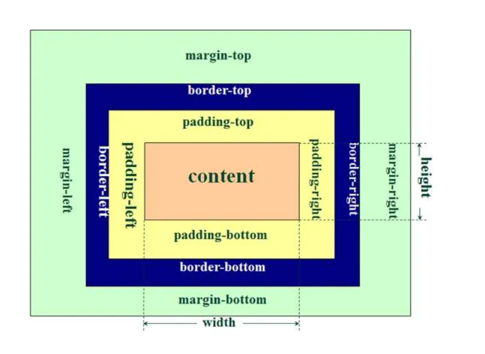
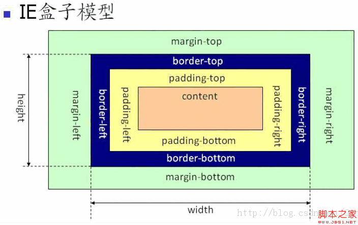

## CSS常见问题整理

> 整理CSS相关问题

### CSS优先级

行内样式（`style=""`） > ID选择器（`#box{}`） > 类选择器（`.con{}`） > 标签选择器（`div {}`） > 通用选择器（`*{}`）

`!import` > 内联样式(1000) > ID选择器(0100) > 类选择器/属性选择器/伪类选择器(0010) > 元素选择器/伪元素选择器(0001) > 关系选择器/通配符选择器(0000)


### `重排（reflow）`和`重绘（repaint）`的理解

> 重排（回流）：无论通过什么方式影响了元素的**几何信息**（元素在视窗内的位置和尺寸大小），浏览器需要**重新计算**元素在视窗内的集合属性，这个过程叫做重排；
>
> 重绘：通过构造渲染书和重排（回流）阶段，我们知道了哪些节点是可见的，以及可见节点的样式和具体的几何信息，接下来就可以将渲染树的每个节点都转换为屏幕上的**实际像素**，这个过程叫做重绘。

重排 必引起 重绘，重绘 不一定引起 重排。


### BFC容器

> 1. BFC（Block Formatting Context）直译为"块级格式化上下文"。BFC它是一个**独立的渲染区域**，只有Block-level box（块元素）参与，它**规定了内部的Block-level box如何布局**，并且与这个**区域外部毫不相干**。
> 2. 理解为：创建了BFC的元素就是一个独立的盒子，里面的子元素不会在布局上影响外面的元素（里面怎么布局都不会影响外部），BFC仍属于文档中的普通流。
> 3. 不是所有的元素、模式都能产生BFC。w3c规范：display属性为block，list-item，table的元素，会产生BFC。

**BFC原理：**

1. 内部的Box会在垂直方向，一个接一个地放置。
2. Box垂直方向的距离由margin决定。属于同一个BFC的两个相邻Box的margin会发生重叠。
3. 每个元素的margin box的左边，与包含块border box的左边相接触（对于从左往右的格式化，否则相反）。即使存在浮动也是如此。
4. BFC的区域不会与float box重叠。
5. BFC就是页面上的一个隔离的独立容器，容器里面的子元素不会影响到外面的元素。反之也如此。
6. 计算BFC的高度时，浮动元素也参与计算。

**创建BFC：**

1. 根元素
2. float属性不为none
3. position属性不为static和relative
4. overflow不为visible
5. display为inline-block、table-cell、table-caption、flex、inline-flex

**BFC作用：**

1. 防止外边距重叠。BFC导致的属于同一个BFC中的子元素的margin重叠（Box垂直方向的距离由margin决定。属于同一个BFC的两个相邻Box的margi会发生重叠）
   解决方法：将其中一个div包裹容器，生成另一个BFC。
2. 清除浮动的影响。块级子元素浮动，如果块级父元素没有设置高度，其会有高度塌陷的情况发生。（子元素浮动后，均开启了BFC，父元素不会被子元素撑开。）
   解决方法：只要将父容器设置为BFC就可以把子元素包含进去：这个容器将包含浮动的子元素，它的高度将扩展到可以包含它的子元素，在这个BFC，这些元素将回到页面的常规文档流。
3. 防止文字环绕


### flex布局、用法、属性

> flex属性在父容器中使用，`display: flex`。
>
> 主轴方向为子项目排列方向，垂轴为子项目换行方向；主轴默认为从左至右，可由`flex-direction`修改，侧轴默认为从上至下，可由`flex-warp`修改。
>
> 主轴若水平，垂轴则垂直，反之，主轴若垂直，垂轴则水平。`flex-direction`影响主轴，主轴影响垂轴

**flex父容器属性**

1. `flex-direction----子项目的排列方向(修改主轴方向)`
   - `row(初期值)----从左至右排列`
   - `row-reverse----从右至左排列`
   - `column----从上至下排列(垂轴变为水平方向)`
   - `column-reverse----从下至上排列(垂轴变为水平方向)`
2. `flex-wrap----子项目多行设置(修改垂轴方向)垂轴方向换行`
   - `nowrap(初期值)----不换行`
   - `wrap----换行`
   - `wrap-reverse----向上换行(垂轴方向反转)`
3. `flex-flow----flex-direction和flex-wrap一起指定`
4. `justify-content----水平对齐(主轴的对齐方式)`
   - `flex-start(初期值)----主轴起边方向对齐`
   - `flex-end----主轴终边方向对齐`
   - `center----主轴居中对齐`
   - `space-between----主轴方向均匀布置，起终边距边距不分配空间`
   - `space-around----主轴方向均匀布置，起终边距边距分配空间`
5. `align-items----垂直对齐(垂轴的对齐方式，只对一行有效)`
   - `stretch(初期值)----垂轴方向拉伸铺满`
   - `flex-start----垂轴起边方向对齐`
   - `flex-end----垂轴终边方向对齐`
   - `center----垂轴居中对齐`
   - `baseline----依据子项目第一行文字的基线对齐`
6. `align-content----多行对齐`
   - `stretch(初期值)----垂轴方向拉伸铺满`
   - `flex-start----垂轴起边方向对齐`
   - `flex-end----垂轴终边方向对齐`
   - `center----垂轴居中对齐`
   - `space-between----垂轴方向均匀布置，起终边距边距不分配空间`
   - `space-around----垂轴方向均匀布置，起终边距边距分配空间`

**flex子项目**

1. `order----顺序指定(order: 2)根据属性数值大小升序从主轴起边向终边布置子项目`
2. `flex-grow----子项目延伸比率(flex-grow: 2)项目的放大比例，默认为0，即如果存在剩余空间，也不放大。`
3. `flex-shrink----子项目收缩比率(flex-shrink: 2)项目的缩小比例，默认为1，即如果空间不足，该项目将缩小。`
4. `flex-basis----子项目的基本宽度(flex-basis: 200px|30%)定义了在分配多余空间之前，项目占据的主轴空间`
5. `flex----flex-grow、flex-shrink、flex-basis一起指定`
6. `align-self----子要素垂直对齐(垂轴的对齐方式，只对单个子项目有效)`
   - `auto(初期值)----继承父元素的align-items`
   - `flex-start----垂轴起边方向对齐`
   - `flex-end----垂轴终边方向对齐`
   - `center----垂轴居中对齐`
   - `stretch----垂轴方向拉伸铺满`
   - `baseline----依据子项目第一行文字的基线对齐`


### 清除浮动：clear（4种方法）

> 清除浮动主要是为了解决：父元素因为子级元素浮动引起的内部高度为0的问题

**clear: clear**本质就是闭合浮动，就是让父盒子闭合出口和入口，不让子盒子出来

1. **额外标签法**（在最后一个浮动标签后，新加一个标签，给其设置`clear: both;`）（不推荐）

   ```html
   <!DOCTYPE html>
   <html lang="en">
   <head>
       <meta charset="UTF-8">
       <meta name="viewport" content="width=device-width, initial-scale=1.0">
       <meta http-equiv="X-UA-Compatible" content="ie=edge">
       <title>Document</title>
       <style>
           .fahter {
               width: 400px;
               border: 1px solid deeppink;
           }
           .big {
               width: 200px;
               height: 200px;
               background: darkorange;
               float: left;
           }
           .small {
               width: 120px;
               height: 120px;
               background: darkmagenta; 
               float: left;
           }
           .footer {
               width: 900px;
               height: 100px;
               background: darkslateblue;
           }
           .clear {
               clear:both;
           }
       </style>
   </head>
   <body>
       <div class="fahter">
           <div class="big">big</div>
           <div class="small">small</div>
           <div class="clear">额外标签法</div>
       </div>
       <div class="footer"></div>
   </body>
   </html>
   ```

   - 优点：通俗易懂，方便
   - 缺点：添加无意义标签，语义化差

2. **父级添加overflow属性**（父元素添加`overflow: hidden;`）（不推荐）

   > 通过触发BFC方式，实现清除浮动

   ```html
   .father {
   	width: 400px;
   	border: 1px solid deeppink;
   	overflow: hidden;
   }
   ```

   - 优点：代码简洁
   - 缺点：内容增多的时候容易造成不会自动换行导致内容被隐藏掉，无法显示要溢出的元素

3. **使用after伪元素清除浮动**（推荐使用）

   ```html
   .clearfix::after{/*伪元素是行内元素 正常浏览器清除浮动方法*/
       content: "";
       display: block;
       height: 0;
       clear:both;
       visibility: hidden;
   }
   .clearfix{
       *zoom: 1;/*ie6清除浮动的方式 *号只有IE6-IE7执行，其他浏览器不执行*/
   }
    
   <body>
       <div class="fahter clearfix">
           <div class="big">big</div>
           <div class="small">small</div>
           <!--<div class="clear">额外标签法</div>-->
       </div>
       <div class="footer"></div>
   </body>
   ```

   - 优点：符合闭合浮动思想，结构语义化正确
   - 缺点：ie6-7不支持伪元素：after，使用zoom: 1触发hsaLayout

4. **使用before和after双伪元素清除浮动**

   ```html
   .clearfix::after,.clearfix::before{
       content: "";
       display: table;
   }
   .clearfix::after{
       clear: both;
   }
   .clearfix{
       *zoom: 1;
   }
    
   <div class="fahter clearfix">
       <div class="big">big</div>
       <div class="small">small</div>
   </div>
   <div class="footer"></div>
   ```

   - 优点：代码更简洁
   - 缺点：用zoom: 1触发hasLayout


### position定位

> ```
> position: static|absolute|fixed|relative|sticky
> ```

##### 属性

1. `static(初期值)----没有定位，元素出现在正常文档流中`
2. `absolute----绝对定位的元素的位置相对于最近的已定位的父元素，如果没有已定位的父元素，那么它的位置相对于`
   - absolute 定位使元素的位置与文档流无关，因此不占据空间。
   - absolute 定位的元素和其他元素重叠。
3. `fixed----元素的定位相对于浏览器窗口是固定位置。即使窗口是滚动的它也不会移动`
   - Fixed 定位使元素的位置与文档流无关，因此不占据空间。
   - Fixed定位的元素和其它元素重叠。
4. `relative----相对定位元素的定位是相对其正常位置`
   - 移动相对定位元素，但它原本所占的空间不会改变。
5. `sticky----粘性定位的元素是依赖于用户的滚动，在position: relative与position: fixed定位之间切换`
   - 它的行为就像`position: relative`当页面滚动超出目标区域时，它的表现就像`position:fixed`,它会固定在目标位置。
   - 元素定位表现为跨越特点阈值前为相对定位，之后为固定定位。
   - 这个特定阈值指的是top、right、buttom或left之一，换言之，指定top、right、buttom或left四个阈值其中之一，才可使粘性定位生效，否则其行为与相对定位相同

```
<html lang="en">
<head>
    <meta charset="UTF-8">
    <meta http-equiv="X-UA-Compatible" content="IE=edge">
    <meta name="viewport" content="width=device-width, initial-scale=1.0">
    <title>Document</title>

    <style>
        .container {
            width: 1000px;
            height: 2000px;
            text-align: center;
            background-color: aquamarine;
            margin: 0 auto;
        }
        .sticky {
            position: sticky;
            top: 20px;
        }
    </style>
</head>
<body>
    <div class="container">
        <h2>sticky示例</h2>
        <button class="sticky">sticky按钮</button>
        <p>在阈值之内的时候，sticky表现为relative的形式</p>
        <p>当超过阈值之后，sticky表现为fixed的形式</p>
    </div>
</body>
</html>
```


### CSS选择器

> 基本选择器：
>
> - `通用选择器: 使用*，选择所有元素`
> - `元素选择器: 直接使用元素名（例如h2），选择所有该元素`
> - `类选择器: .class属性名，选择class为该属性名的所有元素`
> - `id选择器: #id属性名，选择id为该属性名的元素（id属性名唯一）`

**复合选择器**

> 复合选择器至少两个基本选择器通过不同方式进行组合
>
> 使用方法：选择器1 (方法名称) 选择器2

1. 交集选择器
   - 相邻两选择器之间不使用间隔，匹配两种选择元素的交集，一般为元素选择器和类或id选择器
2. 并集选择器（分组选择器）`逗号`
   - 相邻两选择器之间使用`逗号`，匹配两种选择元素的并集
3. 后代选择器（包含选择器）`空格`
   - 相邻两选择器之间使用`空格`，匹配选择器1所匹配元素的**所有后代**中匹配选择器2的元素
4. 子元素选择器`大于号`
   - 相邻两选择器之间使用`>`，匹配选择器1所匹配元素的**直接子元素**中匹配选择器2的元素
5. 相邻兄弟选择器`加号`
   - 相邻选择器之间使用`+`，匹配选择器1所匹配元素后出现的匹配选择器2的**一个元素**
6. 通用兄弟选择器`波浪号`
   - 相邻选择器之间使用`~`，匹配选择器1所匹配元素后出现的匹配选择器2的**所有元素**

**伪元素选择器**

- `::first-line选择器: 仅对块级元素内的第一行内容有效，而对于<a>这类行内元素不起作用`
- `::first-letter选择器: 仅对块级元素的第一个字符有效`
- `::before选择器: 用来给选择的元素前添加content内容，可添加文本或者url图片样式`
- `::after选择器: 用来给选择的元素后添加content内容，可添加文本或者url图片样式`
- `::selection选择器: 用来给选择鼠标选中的文本设置css样式`

**伪类选择器**

**动态伪类选择器**

- `:link----未被访问的样式`
- `:visited----已访问的样式`
- `:hover----鼠标滑过的样式`
- `:active----鼠标点击的样式`
- `:focus----获取焦点的样式`

**UI伪类选择器**

- `:enabled----设置表单元素的"enable"这种状态的样式`
- `:disabled----设置表单元素的"disabled"这种状态的样式`
- `:checked----设置表单元素被选中的样式`
- `:required----设置必选元素的样式`
- `:optional----设置可选元素的样式`
- `:default----默认元素的样式`
- `:valid----设置用户输入"合法"对应的样式`
- `:invalid----设置用户输入"非法"对应的样式`
- `:in-range----设置用户输入"在范围内"对应的样式`
- `:out-of-range----设置用户输入"不在范围内"对应的样式`
- `:read-only----设置输入"只读"对应的属性`
- `:read-write----设置输入"可读可写"对应的样式`
- `:indeterminate----用于表示状态不确定的表单元素`

`<input type="checkbox">` 元素，其 indeterminate 属性被 JavaScript设置为 true 。
`<input type="radio">` 元素, 表单中拥有相同 name值的所有单选按钮都未被选中时。
处于不确定状态的 `<progress>` 元素。

**结构伪类选择器**

- `:root----设置根元素的样式`
- `:nth-child(n)----指定父元素中第n个子元素`
- `:nth-last-child(n)----指定父元素中倒数第n个子元素`
- `nth-of-type(n)----指定父元素中具体第n个具体元素`
- `:nth-last-of-type(n)----指定父元素中具体倒数第n个具体元素`
- `:first-child----指定父元素的第一个元素`
- `:last-child----指定父元素的最后一个元素`
- `:first-of-type----指定父元素的第一个具体元素`
- ``:last-of-type----指定父元素的最后一个具体元素``
- `:only-child----指定父元素中唯一的元素`
- `:only-of-type----指定父元素中唯一的具体元素`
- `:empty----设置空元素的样式`

**其他伪类选择器**

- `:target----设置当前活动的target元素的样式`
- `:lang----为不同语言设置样式`
- `:not(selector)----为非selector选择的元素设置样式`


**属性选择**

| 语法             | 说明                                                         |
| ---------------- | ------------------------------------------------------------ |
| [ attr ]         | 匹配定义了`attr`属性的元素，不需要考虑属性值                 |
| [ attr="val" ]   | 匹配定义了`attr`属性的元素，且属性值为“val”字符串的元素      |
| [ attr^="val" ]  | 匹配定义了`attr`属性的元素，且属性值以“val”字符串开头的元素  |
| [ attr$="val" ]  | 匹配定义了`attr`属性的元素，且属性值以“val”字符串结尾的元素  |
| [ attr*="val" ]  | 匹配定义了`attr`属性的元素，且属性值包含“val”字符串的元素    |
| [ attr~="val" ]  | 匹配定义了`attr`属性的元素，且属性值为“val”字符串的元素（如有多个属性值，则只需要其中一个属性值匹配即可） |
| [ attr\|="val" ] | 匹配定义了`attr`属性的元素，且属性值由连字符进行分割（比如lang="en-uk"），其中第一个字符串是“val”的元素 |


### 盒子模型

> 分为`W3C`和`IE`盒子模型，默认为`W3C`盒子模型

**W3C**



**IE**



**盒子模型使用**

在元素样式中使用`box-sizing`属性

`content-box`表示W3C盒子模型，`border-box`表示IE盒子模型。