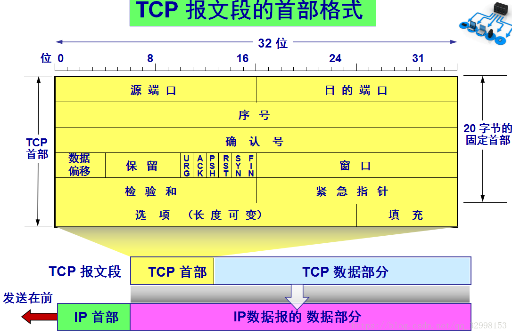
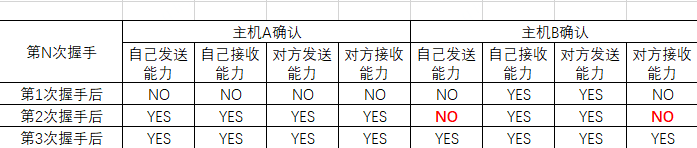

## 计算机网络常见问题

### 浏览器输入url后流程

> - **DNS**解析
> - 发起**TCP**连接
> - 发起**HTTP**请求
> - 服务器**处理请求**并返回HTTP报文
> - 浏览器**解析渲染**页面
> - 连接结束

#### DNS解析

> 作用：将域名地址转换为ip地址。

说明：首先在**本地的域名服务器**中查找，没有再到**根域名服务器**查找，没有再去**com顶级域名服务器**查找，找到后，记录在本地，供下次使用。（DNS：Domain Name System域名系统，使用应用层协议）

### 发起TCP连接

> TCP提供一种**可靠的**传输，涉及**三次握手**、**四次挥手**。

#### 三次握手

> 采用三次握手是为了防止失效的连接请求报文突然又传送到主机B，因而产生错误，失效的连接请求报文段是指：
>
> 主机A发出连接请求没有收到主机B的确认，于是经过一段时间后，主机A又重新向主机B发送连接请求，且建立成功，顺利完成数据传输。但有一种特殊情况，主机A第一次发送的连接请求并没有丢失，而是因为网络节点导致延迟到达主机B，主机B以为是主机A又发起的新连接，于是主机B同意连接，并向主机A发回确认，但此时主机A根本不会理会，主机B就一直等待主机A发送数据，导致主机B的资源浪费。

**TCP之所以需要3次握手是因为TCP双方都是全双工的**。

