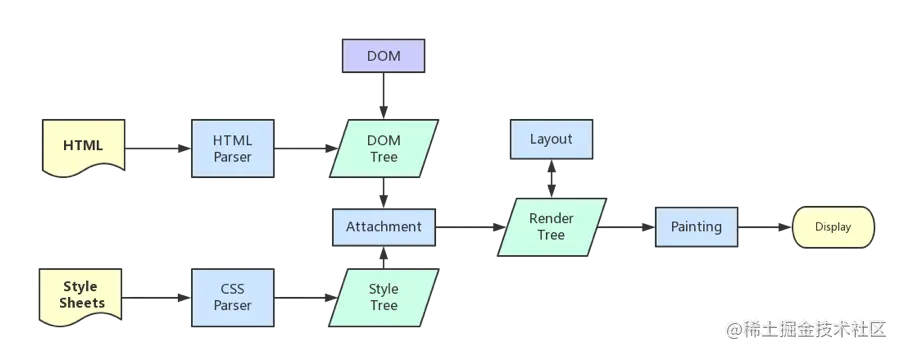
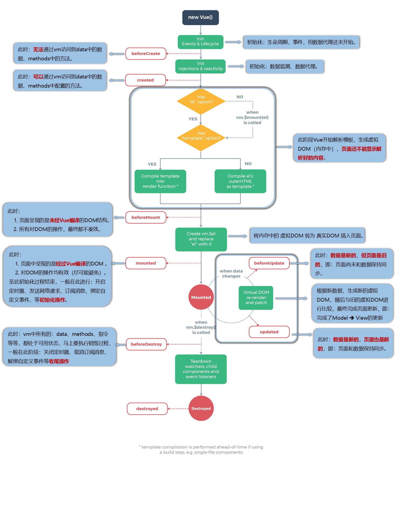

## 前端面经

### HTML

#### HTML语义化

> $什么是HTML语义化$
>
> - 根据内容的结构化（内容语义化），选择合适的标签（代码语义化）便于开发者阅读和写出更优雅的代码的同时让浏览器的爬虫和机器很好地解析。
>
> $为什么要语义化$
>
> - 为了在没有CSS的情况下，页面也能呈现出很好地内容结构和代码结构。
> - 用户体验：例如title、alt用于解释名词或解释图片信息。
> - 有利于SEO：和搜索引擎建立良好沟通，有助于爬虫爬取更多的有效信息：爬虫依赖于标签来确定上下文和各个关键字的权重；
> - 方便其他设备解析（如屏幕阅读器、盲人阅读器、移动设备）以意义的方式来渲染网页；
> - 便于团队开发和维护，语义化更具可读性，可以减少差异化。


#### HTML5新标签

> 结构标签：`<header>`，`<nav>`、`<section>`、`<article>`、`<aside>`、`<figure>`、`<hgroup>`、`<footer>`
>
> 表单标签（针对input的type）：`search`、`email`、`url`、`number`、`range`、`color`、`date`
>
> 媒体标签：`<video>`、`<audio>`、`<embed>`
>
> 其他功能标签：`<progress>`、`<datalist>`、`<detail>`、`<mark>`、`<time>`、`<canvas>`、`<ruby>`、`<command>`


#### head标签中常见标签：meta


> meta标签中，name定义标签作用类型，content定义具体作用

name="viewport"时content内容

- `width: 以pixels(像素)为单位，定义viewport(视口)的宽度`
- `height: 以pixels(像素)为单位，定义viewport(视口)的高度`
- `initial-scale: 定义设备宽度(纵向模式下的设备宽度或横向模式下的设备高度)与视口大小之间的缩放比率`
- `maximum-scale: 定义缩放的最大值；他必须大于或等于minimum-scale的值，不然会导致不确定的行为发生`
- `minimum-scale: 定义缩放的最小值；他必须小于或等于maximum-scale的值，不然会导致不确定的行为发生`
- `user-scalable: 如果设置为no，用户将不能放大或缩小网页。默认为yes`


#### script标签中的属性：defer、async

> `charset----规定在脚本中使用的字符编码(仅适用于外部脚本)`
>
> `src----规定外部脚本的URL`
>
> `type----规定脚本的MIME类型`
>
> `defer----延迟加载脚本，页面加载之后才会运行脚本`
>
> `async----异步执行脚本，一旦脚本可用，则会异步运行`

##### defer和async的区别

由于当html解析到script标签时就会发生阻塞（只解析js脚本）

defer和async都用于外部脚本下载，区别在于async异步下载完成后会立即执行，即阻塞html解析，而defer下载完成后不会立即执行，而是等待页面内解析完成后执行。

- async适合于第三方脚本，不需要操作DOM
- defer适合于需要操作DOM的js脚本


#### canvas属性

> `<canvas>标签只是图形容器，必须通过脚本（通常是Javascript）来绘制图形`

属性：height、width规定画布大小


#### href和src的区别

$src的特性$

1. 引用外部资源：比如`script`元素、`img`元素、`video`元素
2. 会替换元素本身的内容：导入文档的内容会嵌入到当前元素中，导致原本的内容被替换掉
3. 会暂停其他资源的下载：当浏览器解析到使用src的元素时，会暂停其他资源的下载，直到src引用资源加载、编译、执行完毕。这也是为什么script元素推荐放到html结构的底部

$href的特性$

1. 表示超链接：比如`a`标签、`link`标签，表示外部资源与该页面的联系
2. 不会替换元素本身的内容
3. 不会暂停其他资源的下载：像css那样影响页面观感的可以放在html结构的头部优先加载

核心思想的不同

- src代表的是网站的一部分，没有会对网站的使用造成影响
- href代表网站的附属资源，没有不会对网站的核心逻辑和结构造成影响

为什么引用src使用href？

- 正如href代表的含义一样，CSS属于网站的附属资源，不影响网站核心逻辑和结构
- 也可以简单归结为历史遗留问题


#### 如何导入css和js

> 导入CSS
>
> - 行内式：即在标签元素的style属性中设定CSS样式
>
>   ```html
>   <h2 style="color: white; background-color: blue;">This is a line of Text</h2>
>   ```
>
> - 嵌入式：使用style标签设置CSS
>
>   ```html
>   <style>
>       h2 {
>           color: white;
>           background-color: blue;
>       }
>   </style>
>   ```
>
> - 链接式：使用link标签引入外部CSS文件
>
>   ```html
>   <link rel="stylesheet" type="text/css" href="style.css">
>   ```
>
> - 导入式：使用CSS的规则引入外部CSS文件
>
>   ```html
>   <style>
>   	@import "style.css"
>   	/* @import url("style.css") */
>   </style>
>   ```

> 导入js
>
> - 外部引入：使用script标签中的src
>
>   ```html
>   <script type="text/javascript" src="path.js"></script>
>   ```
>
> - 内部引入：使用script标签
>
>   ```html
>   <script type="text/javascript">
>   	coding
>   </script>
>   ```
>
> - 行内引入：在标签中使用js代码
>
>   ```html
>   <input type="button" value="行内引入" onclick="javascript:alert(123)">
>   ```


#### 少见HTML属性

1. Multiple

   > `multiple` 属性是一个布尔值，允许用户在 `<input>` 标签操作，`<input>` 标签的类型 `type` 是 `file` 或者 `email`。当然，你也可以用在 `<select>` 标签。
   >
   > 对于 `email` 类型的 `<input>`，添加上 `multiple` 属性，你输入的邮箱值需要用 `,` 分隔开，内容不允许有空格。
   >
   > 对于 `file` 类型的 `<input>`，你可以多选文件上传。

   ```html
   <input type="file" multiple />
   ```

2. Accept

   > `<input>` 元素有 `accept` 属性，它允许你指明上传文件 `file` 的类型。
   >
   > 你需要通过 `,` 来分割文件类型。

   ```html
   <input type="file" accept=".png, .jpg" />
   ```

3. Contenteditable

   > `contenteditable` 是一个全局的属性（对于所有的 HTML 元素都适用），它可以使得 `HTML` 的可被用户编辑。
   >
   > **需要注意的是，它仅对可见内容和DOM的内容进行更改。**

   ```html
   <div contenteditable="true">I'm a cool editable div ;)</div>
   ```

   > 当然，如果你想使得整个文档的内容都可以编辑，你可以直接使用 `document.designMode = "on"`，关闭编辑则使用 `document.designMode = "off"`。如果你想保存整个文档或者某个编辑内容，可以直接通过 DOM 操作完成。

4. Spellcheck

   > `spellcheck` 也是一个全局的属性，可以检验 `HTML` 内容是否有拼写的语法错误，你可以用在 `input` 或其他元素上。
   >
   > 注意：通常不检查不可编辑元素的拼写错误，即使 `spellcheck` 被设置为 `true` 并且浏览器支持检查。

   ```html
   <!-- 不检查 -->
   <p spellcheck="true">
   Thanks furr checkinng my speling :)</p>
   
   <!-- 检查 -->
   <p contenteditable="true" spellcheck="true">
   Thanks furr checkinng my speling :)</p>
   ```

5. Translate

   > `translate`告诉浏览器制定的内容是否应该被翻译。

   ```html
   <footer><p translate="no">LearnPine</p></footer>
   ```

6. Poster

   > 当视频正在加载中或者当用户开始播放视频前，我们可以用 `poster` 属性设定指定的视频海报。
   >
   > 如果 `poster` 未指定图片，则视频的第一帧可用之后作为海报显示。

   ```html
   <video controls 
   src="https://bit.ly/3nWh78w"
   poster="posterImage.png">
   </video>
   ```

7. Download

   > `Download`属性结合`<a>`元素，告诉浏览器下载的`URL`，而不是到导航到它，提示用户将其下载到本地。还可以命名文件。

   ```html
   <a href="index.html" download="fileName">Download me :)</a>
   ```

   `url`指向video，image资源，不会直接下载，会进行跳转


### CSS

#### css优先级

> 行内样式（`style=""`） > ID选择器（`#box{}`） > 类选择器（`.con{}`） > 标签选择器（`div {}`） > 通用选择器（`*{}`）
>
> `!import > 内联样式(1000) > ID选择器(0100) > 类选择器/属性选择器/伪类选择器(0010) > 元素选择器/伪元素选择器(0001) > 关系选择器/通配符选择器(0000)`


#### 重排（reflow）和重绘（repaint）的理解

- 重排（回流）：无论通过什么方式影响了元素的**几何信息**（元素在视口内的位置和尺寸大小），浏览器需要**重新计算**元素在视口内的集合属性，这个过程叫做重排。
- 重绘：通过构造渲染树和重排（回流）阶段，我们知道了哪些节点是可见的，以及可见节点的样式和具体的几何信息，接下来就可以将渲染树的每个节点都转换为屏幕上的**实际像素**，这个阶段就叫做重绘。


#### margin为负值的情况

> `margin-left`：元素自身朝左移动相应距离。
>
> `margin-right`：自身不移动，右侧元素会向左移动相应的距离。
>
> `margin-top`：元素自身朝上移动相应距离。
>
> `mrgin-bottom`：自身不移动，底部元素会向上移动相应的距离。


#### BFC

$什么是BFC$

> 1. BFC（Block Formatting Context）直译为"块级格式化上下文"。BFC它是一个**独立的渲染区域**，只有Block-level box（块元素）参与，它**规定了内部的Block-level box如何布局**，并且与这个**区域外部毫不相干**。
> 2. 理解为：创建了BFC的元素就是一个独立的盒子，里面的子元素不会在布局上影响外面的元素（里面怎么布局都不会影响外部），BFC仍属于文档中的普通流。
> 3. 不是所有的元素、模式都能产生BFC。w3c规范：display属性为block，list-item，table的元素，会产生BFC。

$BFC的原理$

> 1. 内部的Box会在垂直方向，一个接一个地放置。
> 2. Box垂直方向的距离由margin决定。属于同一个BFC的两个相邻Box的margin会发生重叠。
> 3. 每个元素的margin box的左边，与包含块border box的左边相接触（对于从左往右的格式化，否则相反）。即使存在浮动也是如此。
> 4. BFC的区域不会与float box重叠。
> 5. BFC就是页面上的一个隔离的独立容器，容器里面的子元素不会影响到外面的元素。反之也如此。
> 6. 计算BFC的高度时，浮动元素也参与计算。

$如何创建BFC$

> 1. 根元素
> 2. float属性不为none
> 3. position属性不为static和relative
> 4. overflow不为visible
> 5. display为inline-block、table-cell、table-caption、flex、inline-flex

$BFC作用$

> 1. 防止外边距重叠。BFC导致的属于同一个BFC中的子元素的margin重叠（Box垂直方向的距离由margin决定。属于同一个BFC的两个相邻Box的margi会发生重叠）
>    解决方法：将其中一个div包裹容器，生成另一个BFC。
> 2. 清除浮动的影响。块级子元素浮动，如果块级父元素没有设置高度，其会有高度塌陷的情况发生。（子元素浮动后，均开启了BFC，父元素不会被子元素撑开。）
>    解决方法：只要将父容器设置为BFC就可以把子元素包含进去：这个容器将包含浮动的子元素，它的高度将扩展到可以包含它的子元素，在这个BFC，这些元素将回到页面的常规文档流。
> 3. 防止文字环绕


#### 块级元素和行内元素

> 常见的块级元素有：`<address>`、`<article>`、`<aside>`、`<blockquote>`、`<canvas>`、`<dd>`、`<div>`、`<dl>`、`<dt>`、`<fieldset>`、`<figcaption>`、`<figure>`、`<footer>`、`<form>`、`<h1>~<h6>`、`<header>`、`<hr>`、`<li>`、`<main>`、`<nav>`、`<noscript>`、`<ol>``<output>`、`<p>`、`<pre>`、`<section>`、`<table>`、`<tfoot>`、`<ul>`、`<video>`
>
> 常见的行内元素有：`<span>`、 `<a>`、`<lable>`、`<strong>`、`<b>`、`<small>`、`<abbr>`、`<button>`、`<input>`、`<textarea>`、`<select>`、`<code>`、``、`<br>`、`<q>`、`<i>`、`<cite>`、`<var>`、`<kbd>`、`<sub>`、`<bdo>`
>
> 区别：
>
> - 排列方式：块级元素会独占一行，而行内元素会在一行内显示，直至内容无法显示才会换行
> - 宽高边距设置：块级元素可以设置`width`、`height`和`margin`，而行内元素设置无效
> - 默认宽度：块级元素的`width`默认为100%，而行内元素是根据其内容或子元素来决定其宽度。
>
> 行内块元素同时拥有行内元素和块级元素的特点。


#### flex布局、用法、属性

> flex属性在父容器中使用，`display: flex`。
>
> 主轴方向为子项目排列方向，垂轴为子项目换行方向；主轴默认为从左至右，可由`flex-direction`修改，侧轴默认为从上至下，可由`flex-warp`修改。
>
> 主轴若水平，垂轴则垂直，反之，主轴若垂直，垂轴则水平。`flex-direction`影响主轴，主轴影响垂轴

##### flex父容器属性

1. `flex-direction----子项目的排列方向(修改主轴方向)`
   - `row(初期值)----从左至右排列`
   - `row-reverse----从右至左排列`
   - `column----从上至下排列(垂轴变为水平方向)`
   - `column-reverse----从下至上排列(垂轴变为水平方向)`
2. `flex-wrap----子项目多行设置(修改垂轴方向)垂轴方向换行`
   - `nowrap(初期值)----不换行`
   - `wrap----换行`
   - `wrap-reverse----向上换行(垂轴方向反转)`
3. `flex-flow----flex-direction和flex-wrap一起指定`
4. `justify-content----水平对齐(主轴的对齐方式)`
   - `flex-start(初期值)----主轴起边方向对齐`
   - `flex-end----主轴终边方向对齐`
   - `center----主轴居中对齐`
   - `space-between----主轴方向均匀布置，起终边距边距不分配空间`
   - `space-around----主轴方向均匀布置，起终边距边距分配空间`
5. `align-items----垂直对齐(垂轴的对齐方式，只对一行有效)`
   - `stretch(初期值)----垂轴方向拉伸铺满`
   - `flex-start----垂轴起边方向对齐`
   - `flex-end----垂轴终边方向对齐`
   - `center----垂轴居中对齐`
   - `baseline----依据子项目第一行文字的基线对齐`
6. `align-content----多行对齐`
   - `stretch(初期值)----垂轴方向拉伸铺满`
   - `flex-start----垂轴起边方向对齐`
   - `flex-end----垂轴终边方向对齐`
   - `center----垂轴居中对齐`
   - `space-between----垂轴方向均匀布置，起终边距边距不分配空间`
   - `space-around----垂轴方向均匀布置，起终边距边距分配空间`

##### flex子项目

1. `order----顺序指定(order: 2)根据属性数值大小升序从主轴起边向终边布置子项目`
2. `flex-grow----子项目延伸比率(flex-grow: 2)项目的放大比例，默认为0，即如果存在剩余空间，也不放大。`
3. `flex-shrink----子项目收缩比率(flex-shrink: 2)项目的缩小比例，默认为1，即如果空间不足，该项目将缩小。`
4. `flex-basis----子项目的基本宽度(flex-basis: 200px|30%)定义了在分配多余空间之前，项目占据的主轴空间`
5. `flex----flex-grow、flex-shrink、flex-basis一起指定`
6. `align-self----子要素垂直对齐(垂轴的对齐方式，只对单个子项目有效)`
   - `auto(初期值)----继承父元素的align-items`
   - `flex-start----垂轴起边方向对齐`
   - `flex-end----垂轴终边方向对齐`
   - `center----垂轴居中对齐`
   - `stretch----垂轴方向拉伸铺满`
   - `baseline----依据子项目第一行文字的基线对齐`


#### 清除浮动：clear（4种方法）

> 清除浮动主要是为了解决：父元素因为子级元素浮动引起的内部高度为0的问题

**clear: clear**本质就是闭合浮动，就是让父盒子闭合出口和入口，不让子盒子出来

1. 额外标签法（在最后一个浮动标签后，新加一个标签，给其设置`clear: both;`）（不推荐）

   ```html
   <!DOCTYPE html>
   <html lang="en">
   <head>
       <meta charset="UTF-8">
       <meta name="viewport" content="width=device-width, initial-scale=1.0">
       <meta http-equiv="X-UA-Compatible" content="ie=edge">
       <title>Document</title>
       <style>
           .fahter {
               width: 400px;
               border: 1px solid deeppink;
           }
           .big {
               width: 200px;
               height: 200px;
               background: darkorange;
               float: left;
           }
           .small {
               width: 120px;
               height: 120px;
               background: darkmagenta; 
               float: left;
           }
           .footer {
               width: 900px;
               height: 100px;
               background: darkslateblue;
           }
           .clear {
               clear:both;
           }
       </style>
   </head>
   <body>
       <div class="fahter">
           <div class="big">big</div>
           <div class="small">small</div>
           <div class="clear">额外标签法</div>
       </div>
       <div class="footer"></div>
   </body>
   </html>
   ```

   - 优点：通俗易懂，方便
   - 缺点：添加无意义标签，语义化差

2. 父级添加overflow属性（父元素添加`overflow: hidden;`）（不推荐）

   > 通过触发BFC方式，实现清除浮动

   ```html
   .father {
   	width: 400px;
   	border: 1px solid deeppink;
   	overflow: hidden;
   }
   ```

   - 优点：代码简洁
   - 缺点：内容增多的时候容易造成不会自动换行导致内容被隐藏掉，无法显示要溢出的元素

3. 使用after伪元素清除浮动（推荐使用）

   ```html
   .clearfix::after{/*伪元素是行内元素 正常浏览器清除浮动方法*/
       content: "";
       display: block;
       height: 0;
       clear:both;
       visibility: hidden;
   }
   .clearfix{
       *zoom: 1;/*ie6清除浮动的方式 *号只有IE6-IE7执行，其他浏览器不执行*/
   }
    
   <body>
       <div class="fahter clearfix">
           <div class="big">big</div>
           <div class="small">small</div>
           <!--<div class="clear">额外标签法</div>-->
       </div>
       <div class="footer"></div>
   </body>
   ```

   - 优点：符合闭合浮动思想，结构语义化正确
   - 缺点：ie6-7不支持伪元素：after，使用zoom: 1触发hsaLayout

4. 使用before和after双伪元素清除浮动

   ```html
   .clearfix::after,.clearfix::before{
       content: "";
       display: table;
   }
   .clearfix::after{
       clear: both;
   }
   .clearfix{
       *zoom: 1;
   }
    
   <div class="fahter clearfix">
       <div class="big">big</div>
       <div class="small">small</div>
   </div>
   <div class="footer"></div>
   ```

   - 优点：代码更简洁
   - 缺点：用zoom: 1触发hasLayout


#### position定位

> `position: static|absolute|fixed|relative|sticky`

##### 属性

1. `static(初期值)----没有定位，元素出现在正常文档流中`
2. `absolute----绝对定位的元素的位置相对于最近的已定位的父元素，如果没有已定位的父元素，那么它的位置相对于<html>`
   - absolute 定位使元素的位置与文档流无关，因此不占据空间。
   - absolute 定位的元素和其他元素重叠。
3. `fixed----元素的定位相对于浏览器窗口是固定位置。即使窗口是滚动的它也不会移动`
   - Fixed 定位使元素的位置与文档流无关，因此不占据空间。
   - Fixed定位的元素和其它元素重叠。
4. `relative----相对定位元素的定位是相对其正常位置`
   - 移动相对定位元素，但它原本所占的空间不会改变。
5. `sticky----粘性定位的元素是依赖于用户的滚动，在position: relative与position: fixed定位之间切换`
   - 它的行为就像`position: relative`当页面滚动超出目标区域时，它的表现就像`position:fixed`,它会固定在目标位置。
   - 元素定位表现为跨越特点阈值前为相对定位，之后为固定定位。
   - 这个特定阈值指的是top、right、buttom或left之一，换言之，指定top、right、buttom或left四个阈值其中之一，才可使粘性定位生效，否则其行为与相对定位相同

```html
<html lang="en">
<head>
    <meta charset="UTF-8">
    <meta http-equiv="X-UA-Compatible" content="IE=edge">
    <meta name="viewport" content="width=device-width, initial-scale=1.0">
    <title>Document</title>

    <style>
        .container {
            width: 1000px;
            height: 2000px;
            text-align: center;
            background-color: aquamarine;
            margin: 0 auto;
        }
        .sticky {
            position: sticky;
            top: 20px;
        }
    </style>
</head>
<body>
    <div class="container">
        <h2>sticky示例</h2>
        <button class="sticky">sticky按钮</button>
        <p>在阈值之内的时候，sticky表现为relative的形式</p>
        <p>当超过阈值之后，sticky表现为fixed的形式</p>
    </div>
</body>
</html>
```


 

#### CSS选择器

> 基本选择器：
>
> - `通用选择器: 使用*，选择所有元素`
> - `元素选择器: 直接使用元素名（例如h2），选择所有该元素`
> - `类选择器: .class属性名，选择class为该属性名的所有元素`
> - `id选择器: #id属性名，选择id为该属性名的元素（id属性名唯一）`

##### 复合选择器

> 复合选择器至少两个基本选择器通过不同方式进行组合
>
> 使用方法：选择器1 (方法名称) 选择器2

1. 交集选择器
   - 相邻两选择器之间不使用间隔，匹配两种选择元素的交集，一般为元素选择器和类或id选择器
2. 并集选择器（分组选择器）`逗号`
   - 相邻两选择器之间使用`逗号`，匹配两种选择元素的并集
3. 后代选择器（包含选择器）`空格`
   - 相邻两选择器之间使用`空格`，匹配选择器1所匹配元素的**所有后代**中匹配选择器2的元素
4. 子元素选择器`大于号`
   - 相邻两选择器之间使用`>`，匹配选择器1所匹配元素的**直接子元素**中匹配选择器2的元素
5. 相邻兄弟选择器`加号`
   - 相邻选择器之间使用`+`，匹配选择器1所匹配元素后出现的匹配选择器2的**一个元素**
6. 通用兄弟选择器`波浪号`
   - 相邻选择器之间使用`~`，匹配选择器1所匹配元素后出现的匹配选择器2的**所有元素**


##### 伪元素选择器

- `::first-line选择器: 仅对块级元素内的第一行内容有效，而对于<a>这类行内元素不起作用`
- `::first-letter选择器: 仅对块级元素的第一个字符有效`
- `::before选择器: 用来给选择的元素前添加content内容，可添加文本或者url图片样式`
- `::after选择器: 用来给选择的元素后添加content内容，可添加文本或者url图片样式`
- `::selection选择器: 用来给选择鼠标选中的文本设置css样式`


##### 伪类选择器

###### 动态伪类选择器

- `:link----未被访问的样式`
- `:visited----已访问的样式`
- `:hover----鼠标滑过的样式`
- `:active----鼠标点击的样式`
- `:focus----获取焦点的样式`

###### UI伪类选择器

- `:enabled----设置表单元素的"enable"这种状态的样式`
- `:disabled----设置表单元素的"disabled"这种状态的样式`
- `:checked----设置表单元素被选中的样式`
- `:required----设置必选元素的样式`
- `:optional----设置可选元素的样式`
- `:default----默认元素的样式`
- `:valid----设置用户输入"合法"对应的样式`
- `:invalid----设置用户输入"非法"对应的样式`
- `:in-range----设置用户输入"在范围内"对应的样式`
- `:out-of-range----设置用户输入"不在范围内"对应的样式`
- `:read-only----设置输入"只读"对应的属性`
- `:read-write----设置输入"可读可写"对应的样式`
- `:indeterminate----用于表示状态不确定的表单元素`

`<input type="checkbox">` 元素，其 indeterminate 属性被 JavaScript设置为 true 。
`<input type="radio">` 元素, 表单中拥有相同 name值的所有单选按钮都未被选中时。
处于不确定状态的 `<progress>` 元素。

###### 结构伪类选择器

- `:root----设置根元素的样式`
- `:nth-child(n)----指定父元素中第n个子元素`
- `:nth-last-child(n)----指定父元素中倒数第n个子元素`
- `nth-of-type(n)----指定父元素中具体第n个具体元素`
- `:nth-last-of-type(n)----指定父元素中具体倒数第n个具体元素`
- `:first-child----指定父元素的第一个元素`
- `:last-child----指定父元素的最后一个元素`
- `:first-of-type----指定父元素的第一个具体元素`
- ``:last-of-type----指定父元素的最后一个具体元素``
- `:only-child----指定父元素中唯一的元素`
- `:only-of-type----指定父元素中唯一的具体元素`
- `:empty----设置空元素的样式`

###### 其他伪类选择器

- `:target----设置当前活动的target元素的样式`
- `:lang----为不同语言设置样式`
- `:not(selector)----为非selector选择的元素设置样式`


##### 属性选择

| 语法             | 说明                                                         |
| ---------------- | ------------------------------------------------------------ |
| [ attr ]         | 匹配定义了`attr`属性的元素，不需要考虑属性值                 |
| [ attr="val" ]   | 匹配定义了`attr`属性的元素，且属性值为“val”字符串的元素      |
| [ attr^="val" ]  | 匹配定义了`attr`属性的元素，且属性值以“val”字符串开头的元素  |
| [ attr$="val" ]  | 匹配定义了`attr`属性的元素，且属性值以“val”字符串结尾的元素  |
| [ attr*="val" ]  | 匹配定义了`attr`属性的元素，且属性值包含“val”字符串的元素    |
| [ attr~="val" ]  | 匹配定义了`attr`属性的元素，且属性值为“val”字符串的元素（如有多个属性值，则只需要其中一个属性值匹配即可） |
| [ attr\|="val" ] | 匹配定义了`attr`属性的元素，且属性值由连字符进行分割（比如lang="en-uk"），其中第一个字符串是“val”的元素 |


#### 元素显示：display: none; visibility: hidden; 区别、重绘、重排。


#### 水平居中

##### text-align: center;

> 作用于行内元素，给父元素设置，子元素将在父元素中水平居中
>
> ```html
> <style>
> 	.div1 {
>         background-color: red;
>         width: 500px;
>         height: 500px;
>         text-align: center;
>     }
>     span {
>         background-color: aqua;
>     }
> </style>
> <div class="div1">
>     <span>123</span>
> </div> 
> ```


##### margin: 0 auto;

> 作用于块级元素，用于水平平均分配多余空间


##### position:absolute; + left: 50%; + transform: translateX(-50%);

> 使用绝对定位和平移实现元素居中，注意需要给父元素定位，不然子元素的定位相对于html
>
> ```css
> .div1 {
>     background-color: red;
>     width: 500px;
>     height: 500px;
>     position: relative;
> }
> .div2 {
>     background-color: blue;
>     width: 200px;
>     height: 200px;
>     position: absolute;
>     left: 50%;
>     transform: translateX(-50%);
> }
> ```


##### flex

> 使用flex布局，给父元素添加style属性`display: flex` + `justify-content: center`
>
> ```css
> .div1 {
>     background-color: red;
>     width: 500px;
>     height: 500px;
>     display: flex;
>     justify-content: center;
> }
> .div2 {
>     background-color: blue;
>     width: 200px;
>     height: 200px;
> }
> ```


#### 垂直居中

##### line-height

> 使用`line-height: 父元素高度`，指定父元素中**单行文本**垂直居中


##### vertical-align: middle

> `vertical-align: middle`只对行内块级元素有效，而且得两个才能对齐，让子元素与伪元素对齐
>
> ```css
> <style>
>     .div1 {
>         background-color: red;
>         width: 500px;
>         height: 500px;
>     }
>     .div2 {
>         background-color: blue;
>         width: 100px;
>         height: 100px;
>         display: inline-block;
>         vertical-align: middle;
>     }
>     .div1::after {
>         content: "";
>         height: 100%;
>         display: inline-block;
>         vertical-align: middle;
>     }
> </style>
> <div class="div1">
>    	<div class="div2"></div>
> </div>
> ```

##### margin: auto 0;

> `margin: auto 0;`属性值auto表示平均分配多余空间，由于div标签占一行，所以一行有多余空间，而列没有多余空间，所有需要设置定位`absolute`，使列有多余空间
>
> ```css
> .div1 {
>        background-color: red;
>        width: 500px;
>        height: 500px;
>        /*给父元素设置相对定位，这样子元素中的绝对定位就会相对于父元素的大小*/
>        position: relative;
> }
> .div2 {
>        background-color: blue;
>        width: 100px;
>        height: 100px;
>        position: absolute;
>        top: 0;
>        bottom: 0;
>        margin: auto 0;
> }
> ```
>


##### position: absolute; + top: 50%; + transform: translateY(-50%);

```html
<!DOCTYPE html>
<html lang="en">
<head>
	<meta charset="UTF-8">
	<title>垂直居中</title>
	<style type="text/css" media="screen">
		.div_2 {
			width: 500px;
			height: 500px;
			background-color: pink;
			position: absolute;
			top: 50%;
			transform: translateY(-50%);
		}
		.div_2 > h2 {
			text-align: center;
			line-height: 500px;
			color: skyblue;
		}
	</style>
</head>
<body>
	<div class="div_2">
		<h2>我是垂直居中的div</h2>
	</div>
</body>
</html>
```

##### flex

> 父元素设置`display: flex;`然后设置`align-items: center;`单行垂直居中，多行垂直居中为`align-content: center;`

```html
<!DOCTYPE html>
<html lang="en">
<head>
    <meta charset="UTF-8">
    <meta http-equiv="X-UA-Compatible" content="IE=edge">
    <meta name="viewport" content="width=device-width, initial-scale=1.0">
    <title>Document</title>
    <style>
        html,body {
            height: 100%;
            width: 100%;
        }
        .container {
            height: 100%;
            display: flex;
            align-items: center;
        }
        .inner {
            width: 200px;
            height: 200px;
            background-color: pink;
        }
    </style>
</head>
<body>
    <div class="container">
        <div class="inner"></div>
    </div>
</body>
</html>
```


#### 盒子模型：W3C、IE，使用

W3C


IE


使用

`在元素样式中使用box-sizing属性`

**content-box表示W3C盒子模型，border-box表示IE盒子模型**


### JS

**setTimeout( )，由于是window上的函数，所以函数内部this指向为window**

如何处理`NaN === NaN`返回true

> 因为js中只有`NaN`和自身是不想等的，当两个需要比较的值都是和自身不相等时，表明两个值都为`NaN`，返回true
>
> ```js
> if (val1 !== val && val2 !== val2) return true;
> ```


#### 堆空间与栈空间

> 1. 在js中，基本数据类型变量大小固定，并且操作简单容易，所以把他们放入栈空间存储。引用数据变量大小不固定，所以把它们分配给堆中，让它们申请空间的时候自己确定大小，这样把它们分开存储能够使得程序运行起来占用的内存最小。
> 2. 栈内存由于它的特点，所以它的系统效率较高。推内存需要分配空间和地址，还要把地址存到栈中，所以效率低于栈。


#### ES6相关内容

> $解构赋值$
>
> ```javascript
> let obj = {
>      a: 10,
>      b: 15
> };
> let {a, b} = obj;	// 创建新的变量a和b，a = 10, b = 15
> let {a: val1, b: val2} = obj;	// 创建新的变量val1和val2，val1 = obj.a，val2 = obj.b
> ```
>
> $扩展运算符$
>
> ```javascript
> let arr1 = [1, 2, 3];
> let arr2 = [4, 5, 6];
> let arr_res = [...arr1, ...arr2];	// [1, 2, 3, 4, 5, 6]
> ```
>
> $模板字符串$
>
> ```JavaScript
> let name = "小明";
> let pharse = `我是${name}，今年18岁`;
> ```
>
> $数组实例方法includes和filter$
>
> $数组扁平化flat$
> `Array.prototype.flat`原型对象上的属性
>
> ```javascript
> let arr = [1, [2, 3, 4, [5]], [6, 7, [8, 9, [10]]], 11, [12, 13]];
> let arr_flat = arr.flat(Infinity);
> // [1, 2, 3, 4, 5, 6, 7, 8, 9, 10, 11, 12, 13]
> ```
>
> $可选链操作符$
>
> ```javascript
> // const name = obj && obj.name;
> const name = obj?.name;
> ```
>
> $空值合并运算符$
>
> ```JavaScript
> val??'';	// 当Boolean(val)为false时，返回''，反之返回val
> // 相当于val ? val : '';
> ```


#### Promise

> `promise.then(res=> {...})`当promise对象状态为`fulfilled`时，回调函数的参数res为promise对象中res函数传输的数据。
>
> `promise.catch(rej=> {...})`当promise对象状态为`rejected`时，回调函数的参数rej为promise对象中rej函数传输的数据。
>
> `promise.all([p1, p2, p3])`参数为包含promise对象的数组，只有`p1、p2、p3`的状态都变成`fulfilled`，返回状态为`fulfilled`的promise对象，此时`p1、p2、p3`的返回值组成一个数组，传递给p的res回调函数。
> 只要`pa、p2、p3`之中有一个被`rejected`，p的状态就变成`rejected`，此时第一个被rej的实例的返回值，会传递给p的回调函数。如果传递的参数不是promise，则会调用`promise.resolve`方法转为Promise
>
> `promise.race([p1, p2, p3])`，只要`p1、p2、p3`之中有一个实例率先改变状态，p的状态就跟着改变。那个率先改变的promise对象的返回值就传递给p的回调函数。
>
> `promise.resolve()`：2个作用，一个是通过静态方法创建Promise对象，另一个使将Thenable对象转换为Pormise对象。
> 参数是一个promise对象，则不进行任何修改，直接返回
> 参数不是具有then方法的对象，或者不是对象。返回状态为fulfilled，参数直接传给res回调函数的promise对象
> 不带任何参数，返回状态为fulfilled，res为空的promise对象
>
> `promise.reject()`返回一个新的promise对象，状态为rejected。参数传给rej回调函数。


#### 事件循环（event loop）

> 事件循环的运行机制时，先回执行栈中的内容，栈中的内容执行后执行微任务，微任务清空后再执行宏任务，先取出一个宏任务，再去执行微任务，然后再取宏任务清空微任务这样不停的循环。
>
> 1. 函数入栈。当Stack中执行到异步任务的时候，就将他丢给WebAPIs，接着执行同步任务，直到Stack为空
> 2. 此期间WebAPIs完成这个时间，把回调函数放入队列中等待执行（微任务放到微任务队列，宏任务放到宏任务队列）
> 3. 执行栈为空时，Event Loop把微任务队列执行清空
> 4. 微任务队列清空后，进入宏任务队列，取队列的第一项任务放入Stack（栈）中执行，执行完成后，查看微任务队列是否有任务，有的话，清空微任务队列。重复4，继续从宏任务中取任务执行，执行完成之后，继续清空微任务，如此反复循环，直至清空所有的任务。
>
> 
>
> 浏览器中的任务源（stack）：
>
> - `宏任务（macrotask）`：宿主环境提供的，比如`setTimeout、setInterval...`
> - `微任务（microtask）`：语言本身提供的，比如`promise.then...`


#### async/await

> $用同步的方式，执行异步操作$
>
> async函数返回一个Promise对象，当函数执行的时候，一旦遇到await就会先返回，等到触发的异步操作完成，再执行函数体内后面的语句。可以理解为，是让出了线程，跳出了async函数体。
>
> **await只能在async函数中使用**，如果await后面不是Promise对象，可能不能实现**排队**功能
>
> ```js
> function request(num) {
>     return new Promise(res=> {
>         setTimeout(()=> {
>             console.log(num * 2);
>             res(num * 2);
>         }, 1000)
>     })
> }
> async func() {
> 	let res1 = await request(1);	
>     let res2 = await request(res1);	
>     console.log(res2);	
> }
> // 输出：(过1s) -> 2 ->(过1s) 4 -> 4
> ```
>
> `async`函数执行完会自动返回一个状态`fulfilled`的Promise，也就是成功状态，但值为undefined，如果需要返回固定值的Promise对象，只需要返回即可。
>
> 总结：
>
> - await只能在async函数中使用，不然会报错
> - async函数返回的是一个Promise对象，有无值取决于有没有return值
> - await后面最好是接Promise对象，虽然接其他值也能达到排队效果
> - async/await作用是**用同步方式，执行异步操作**
>
> ```JavaScript
> // 注意async/await的执行顺序
> async function func() {
>     console.log(1);
>     await new Promise(res=> {
>         console.log(2);
>         res(100);
>     })
>     console.log(3);
> }
> func();
> console.log(4);
> // 输出：1 2 4 3
> ```
>
> 解释：await在async外部执行时会阻塞后面的代码，然后当在async函数内部时，只会阻塞内部代码，不会影响外部代码的执行

```javascript
async function test1() {
	console.log("start test1");
    console.log(await test2());
    console.log("end test1");
}
async function test2() {
    console.log("test2");
    return await "return test2 value";
}
test1();
console.log("start async");
setTimeout(()=> {
    console.log("setTimeout")
}, 0);
new Promise(res=> {
    console.log("promise1");
    res();
}).then(()=> {
    console.log("promise2");
})
console.log("end async");
/*
start test1
test2
start async
promise1
end async
promise2
return test2 value
end test1
setTimeout
*/
```

- 首先执行宏任务，执行test1函数，执行console.log('statr test1')
- 遇到await，先执行右边test2中的console.log('test2')，中断了后面的代码，执行test1外面的同步代码

- 执行console.log('start async');


- 遇到setTimeout，推到到下个宏任务队列中

- 执行Promise里面的同步代码console.log('promise1')

- 运行到promise().then，发现是promise对象，推到微任务队列中


- 执行console.log('end async')

- test1外面的同步代码执行结束后，回到test1中，console.log(await test2())执行完成后返回Promise {`<resolved>`: "return test2 value"}，是promise对象，推到微任务队列中

- 此时第一个宏任务结束，执行所有的微任务，因为微任务队列先进先出，所以先执行console.log('promise2')，后执行console.log('return test2 value')

- 执行test2完成后，后面的代码不再阻塞，执行console.log('end test1');

- 执行下个宏任务，即执行console.log('setTimeout');


#### 为什么`typeof null === "object"`

> 不同的对象在底层都表示为二进制，**在JavaScript中二进制前三位都为0的话会被判断为object类型，null的二进制表示是全为0，自然前三位也是0，所以执行typeof时会返回"object"**
>
> js中，数值是以32字节存储的，由标志位（1~3个字节）和数值组成。标志位存储的是低位的数据。这里有五种标志位：
>
> - 000：对象，数据是对象的应用。
> - 001：整型，数据是31位带符号整数
> - 010：双精度类型，数据是双精度数字
> - 100：字符串，数据是字符串
> - 110：布尔类型，数据是布尔值


#### JS中this的五种情况

1. 作为普通函数执行时，`this`指向`window`。
2. 当函数作为对象的方法被调用时，`this`就会指向`该对象`。
3. 构造函数调用中，`this`指向`返回的这个对象`。
4. 箭头函数中的`this`绑定看是`this所在函数定义在哪个对象下`，就绑定哪个对象。如果有嵌套的情况，则this绑定到最近的一层对象上。
5. 基于`Function.prototype`上的`apply、call和bind`调用模式，这三个方法都可以显示的指定调用函数的this指向。`apply`接收参数的是数组，`call`接收参数列表，`bind`方法**通过传入一个对象，返回一个this绑定了传入对象的新函数。这个函数的this指向除了使用new时会被改变**，其他情况下都不会改变。若为空默认指向全局对象window。


#### 遍历对象的方法

> 对象属性的划分：原型属性（原型对象上的属性）、对象自身可枚举属性、对象自身不可枚举属性、$Symbol属性$
>
> ```javascript
> // 原型属性
> const obj = Object.create({
>     bar: "bar"
> });
> // 对象自身可枚举属性
> obj.foo = "foo";
> // 对象自身不可枚举属性
> Object.defineProperty(obj, "name", {
>     enumerable: false,
>     value: "king"
> });
> // Symbol属性
> obj[Symbol("age")] = "age";
> ```

1. > `for...in`：遍历对象中的key
   > 获取对象自身的可枚举属性 + 原型链上的可枚举属性（包括方法）
   > 不包含Symbol属性
   >
   > 可以使用`Object.prototype.hasOwnProperty(key)`过滤原型链上的属性
   >
   > **PS**：使用`class`和`function`生成的对象
   > 类的内部所定义的方法，都是不可枚举的
   >
   > $属性顺序$：
   >
   > 1. 对于大于等于0的整数，按照大小进行排序（升序），对于小数和负数会当做字符串处理；
   > 2. 对于String类型，能转换为正整数就转换为正整数比较，其余按照定义的顺序进行输出；
   > 3. Symbol属性过滤掉，不会进行输出。

2. > `Object.keys(obj)`：返回存放key的数组
   > 获取对象自身的可枚举属性
   > 不包含原型链上的可枚举属性和Symbol属性（ES5新增）
   >
   > $属性顺序$：同`for...in`

3. > `Object.getOwnPropertyNames(obj)`：返回存放key的数组
   > 获取对象自身的所有属性名，包括不可枚举属性
   > 不包含原型链上的属性和Symbol属性（ES5新增）
   >
   > **PS**：如何判断属性是否可枚举？
   >
   > `Object.getOwnPropertyDescriptor(obj, key)`，第一个参数为对象，第二个参数是key，输出属性的配置
   >
   > `Object.prototype.propertyIsEnumerable(key)`，直接用obj.propertyIsEnumerable(key)，返回布尔值

4. > `Object.getOwnPropertySymbols(obj)`：返回存放key的数组
   > 获取对象自身的所有Symbol属性
   > 不包括原型链上的Symbol属性（ES6新增）

5. > `Reflect.ownKeys(obj)`：返回存放key的数组
   > 获取对象自身的所有属性名，包括不可枚举 + Symbol属性（ES6新增）

`Object.prototype.xxx`表示为Object原型对象上的属性或方法，可以直接使用`obj.xxx`调用

`Object.xxx`表示为Object构造函数上的属性或方法，不可以直接使用`obj.xxx`调用

$总结$

| 方式                                | 基本属性 | 原型链 | 不可枚举 | Symbol |
| ----------------------------------- | -------- | ------ | -------- | ------ |
| $for...in$                          | 是       | 是     | 否       | 否     |
| $Object.keys(obj)$                  | 是       | 否     | 否       | 否     |
| $Object.getOwnPropertyNames(obj)$   | 是       | 否     | 是       | 否     |
| $Object.getOwnPropertySymbols(obj)$ | 否       | 否     | 否       | 是     |
| $Reflect.ownKeys(obj)$              | 是       | 否     | 是       | 是     |

**PS**：`Object.values(obj)`返回一个对象的属性值组成的数组


#### Symbol对象的作用

> Symbol是ES6新引入的一种基本数据类型。

JavaScript标准中规定对象的key只能是string或Symbol类型，区别在于string类型的key可以重复而Symbol类型的key是唯一的Symbol的本质是表示一个唯一标识。每次创建一个Symbol，它所代表的值都不可能重复，该值的内部实现可以视为一段数字。所以理论上Symbol的存在只有一个意义：用于必须使用唯一值的场景。

`Symbol()`不是一个完整的构造函数，因此不能通过`new Symbol()`来创建（通过`new`实例化的结果是一个`object`对象，而不是原始类型的`Symbol`）

`Symbol`不能进行隐式类型转换，但可以显示转为字符串；不能转化为数字，但可以转化为布尔值

$Symbol作为对象的属性$

使用Symbol作为Object的key，可以保证和其他key都不重复。因此，Symbol非常适合用于对对象的属性进行扩展。避免出现相同属性名，产生某一个属性被改写或覆盖的情况。

1. 不能通过点运算符访问，需要通过方括号的形式访问。
2. 不能通过`for...in`、`for...of`遍历，也不会被`Object.keys()`、`Object.getOwnPropertyNames()`、`JSON.stringify()`返回。但是它也不是私有属性，可以通过`Object.getOwnPropertySymbols()`和`Reflect.ownKeys()`方法获取ixiangSymbol属性名

$Symbol的方法$：`Symbo.for()`和`Symbol.keyFor()`

1. `Symbol.for()`：用于描述相同的`Symbol`变量指向同一个`Symbol`值
   它跟`Symbol()`的区别是`Symbol()`定义的值每次都是新建，即使描述相同值也不相等，而`Symbol.for()`定义的值会先检查给定的描述是否已经存在，如果不存在才会新建一个值，并把这个值登记在全局环境中供搜索，`Symbol.for()`定义相同描述的值时会被搜索到，描述相同则他们就是同一个值。
2. `Symbol.keyFor()`：用来检测该字符串参数作为名称的`Symbol`值是否已被登记，返回一个已登记的`Symbol`类型值的`key`

$使用场景$

1. 作为对象属性：当一个复杂对象中含有多个属性的时候，很容易将某个属性名覆盖掉，利用Symbol值作为属性名可以很好的避免这一现象

2. ES6中的类是没有private关键字来声明类的私有方法和私有变量的，但是可以利用Symbol的唯一性来模拟（结合闭包和Symbol实现私有属性和私有方法）

   ```js
   // 一般在函数内封装，这样函数执行完毕就无法找到Symbol，所有成为私有属性或方法
   const speak = Symbol();
   // 当使用Symbol.for()时可以访问
   class Person {
       speak() {
           console.log(123);
       }
   }
   let person = new Person();
   person[speak]()
   ```


#### 作用域链和原型链

> 作用域链：
>
> 当执行一段JavaScript代码（全局代码或函数）时，JavaScript引擎就会为其创建一个作用域（执行上下文），**在页面加载后会首先创建一个全局的作用域，然后每执行一个函数，会建立一个对应的作用域，从而形成了一条作用域链**。每个作用域都有一条对应的作用域链，链头是全局作用域，链尾是当前函数作用域。
>
> 作用域链的作用是用于解析标识符，当函数被创建时，会将this、arguments、命名参数和该函数中的所有局部变量添加到当前作用域中，当JavaScript需要**查找变量x（这个过程称为变量解析），它会首先从作用域链中的链尾也就是当前作用域进行查找是否有x属性，如果没有找到就顺着作用域链继续查找，知道查找到链头**，也就是全局作用域链，如果仍未找到该变量，就认为这段代码的作用域链上不存在x变量，并抛出一个引用错误（ReferenceError）的异常。

> 原型链
>
> 当访问一个对象的某个属性时，会先在这儿该对象本身属性上查找，如果没有找到，则会去它的`__proto__`隐式原型上查找，即它的构造函数的`prototype`，如果还没有找到就会再在构造函数的`prototype`（原型对象）的`__proto__`，这样一层层向上查找就会形成一个链式结构，称为原型链。
>
> 作用：主要是继承的作用；原型上可以定义一些方法和变量；以这个原型建立的对象，可以使用原型方法和变量，从而实现继承


#### for...in 和for...of 区别

> 1. `for...in`用于可枚举数据，如对象、数组、字符串
> 2. `for...of`用于可迭代数据，如数组、字符串、Map、Set


#### 数组循环操作的循环中断

> 循环的方式：
>
> 1. `for`----`for(let i=0; i<arr.length; i++)`循环中`i`为数组的索引
>    `continue`：中断该次循环，开始下一次循环
>    `break`：中断循环，即跳出循环
>    `return`：会报错，`return`适用于结束函数
> 2. `for...in`----`for(let i in arr)`循环中`i`为数组的索引
>    `continue`：中断该次循环，开始下一次循环
>    `break`：中断循环，即跳出循环
>    `return`：会报错，`return`适用于结束函数
> 3. `for...of`----`for(let val of arr)`循环中`val`为数组的值
>    `continue`：中断该次循环，开始下一次循环
>    `break`：中断循环，即跳出循环
>    `return`：会报错，`return`适用于结束函数
> 4. `forEach`----`arr.forEach((val, index, arr)=> {...})`循环中`val`为值，`index`为索引，`arr`为原数组
>    `continue`：报错
>    `break`：报错
>    `return`：跳出本次循环
> 5. `map`----`arr.map((val, index, arr)=> {...})`循环中`val`为值，`index`为索引，`arr`为原数组
>    `continue`：报错
>    `break`：报错
>    `return`：跳出本次循环，并返回值为新数组`index`的值
> 6. `filter`----`arr.filter((val, index, arr)=> {...})`循环中`val`为值，`index`为索引，`arr`为原数组
>    `continue`：报错
>    `break`：报错
>    `return`：跳出本次循环，返回值为布尔值，（`true`保留值，`false`过滤掉）
> 7. `every`----`arr.every((val, index, arr)=> {...})`循环中`val`为值，`index`为索引，`arr`为原数组
>    `continue`：报错
>    `break`：报错
>    `return`：跳出本次循环，`return true`退出本次循环，直接`return`或`return false`会直接退出循环
> 8. `some`----`arr.some((val, index, arr)=> {...})`循环中`val`为值，`index`为索引，`arr`为原数组
>    `continue`：报错
>    `break`：报错
>    `return`：跳出本次循环，`return false`退出本次循环，直接`return`或`return true`会直接退出循环


#### 闭包：为什么使用，有什么问题，有这些问题为什么还要使用

##### 1、什么时候需要使用闭包

> 当需要重复使用一个对象，但又想保护这个对象不被其他代码污染。

##### 2、闭包的作用

> 使得一个外部函数有权访问一个内部函数作用域。

##### 3、闭包的形成必备条件

> (1)需要访问作用域
>
> (2)函数嵌套（物理条件）
>
> (3)被嵌套函数在另一个外部作用域中被调用

##### 4、闭包的缺点

> 比起普通函数，闭包对内存的占用更多，因此建议在使用完毕后，可以手动赋空标记可以回收`fn = null`

```js
// 需求，设置定时器，每一秒执行一次
// 累加器
function counter() {
    let second = 0;
    
    function doCounter() {
        // 到达十秒后停止
        if (second === 10) {
            clearInterval(recordSecond);
            console.log("计时结束！");
            return;
        }
        second += 1;
        console.log(`${second}秒`);
    }
    return doCounter;
}

// 得到累加器
const doCounterFn = counter();
const recordSecond = setInterval(function() {
    // 调用累加器
    doCounterFn();
}, 1000);
```


#### 继承：6种，手写原理

1. 原型链

   > 基本思想：利用原型让一个引用类型继承另一个引用类型的属性和方法。

   ```js
   // 父类
   function Person() {
       this.name = "小明";
       this.eats = ["苹果"];
       this.getName = function() {
           console.log(this.name);
       }
   }
   Person.prototype.get = ()=> {
       console.log("Person.prototype上的方法");
   }
   // 子类
   function Student() {}
   // 继承
   Student.prototype = new Person();
   
   let stu_1 = new Student();
   stu_1.name = "小花";
   stu_1.eats.push("香蕉");
   console.log(stu_1.name);    // 小花
   console.log(stu_1.eats);    // [ '苹果', '香蕉' ]
   stu_1.getName();
   stu_1.get();    // Person.prototype上的方法
   
   console.log("---------------")
   
   let stu_2 = new Student();
   console.log(stu_2.name);    // 小明
   console.log(stu_2.eats);    // [ '苹果', '香蕉' ]
   stu_2.getName();    // 小明
   stu_2.get();    // Person.prototype上的方法
   ```

   - 优点：父类方法可以复用
   - 缺点1：父类所有的引用类型数据（对象、数组）会被子类共享，更改一个子类的数据，其他数据会受到影响， 一起变化；
   - 缺点2：子类实例不能给父类构造函数传参

2. 构造函数的继承

   > 基本思想：在子类型构造函数的内部调用超类构造函数，通过使用call()和apply()方法可以在新创建的对象执行构造函数。

   ```js
   // 父类
   function Person() {
       this.name = "小明";
       this.eats = ["苹果"];
       this.getName = function() {
           console.log(this.name);
       }
   }
   Person.prototype.get = ()=> {
       console.log("Person.prototype上的方法");
   }
   // 子类
   function Student() {
       Person.call(this);
   }
   
   let stu_1 = new Student();
   stu_1.name = "小花";
   stu_1.eats.push("香蕉");
   console.log(stu_1.name);    // 小花
   console.log(stu_1.eats);    // [ '苹果', '香蕉' ]
   stu_1.getName();
   // stu_1.get();    // Person.prototype上的方法
   
   console.log("---------------")
   
   let stu_2 = new Student();
   console.log(stu_2.name);    // 小明
   console.log(stu_2.eats);    // [ '苹果' ]
   stu_2.getName();    // 小明
   // stu_2.get();    // Person.prototype上的方法
   ```

   - 优点：父类的引用类型的数据不会被子类共享，不会相互影响
   - 缺点：子类不能访问父类原型属性上的方法和参数

3. 组合继承

   > 基本思想：将原型链和借用构造函数的技术组合在一块，从而发挥两者之长的一种继承模式。

   ```js
   // 父类
   function Person() {
       this.name = "小明";
       this.eats = ["苹果"];
       this.getName = function() {
           console.log(this.name);
       }
   }
   Person.prototype.get = ()=> {
       console.log("Person.prototype上的方法");
   }
   // 子类
   function Student() {
       Person.call(this);
   }
   Student.prototype = new Person();
   
   let stu_1 = new Student();
   stu_1.name = "小花";
   stu_1.eats.push("香蕉");
   console.log(stu_1.name);    // 小花
   console.log(stu_1.eats);    // [ '苹果', '香蕉' ]
   stu_1.getName();
   stu_1.get();    // Person.prototype上的方法
   
   console.log("---------------")
   
   let stu_2 = new Student();
   console.log(stu_2.name);    // 小明
   console.log(stu_2.eats);    // [ '苹果' ]
   stu_2.getName();    // 小明
   stu_2.get();    // Person.prototype上的方法
   ```

   - 优点：父类可以复用；父类构造函数中的引用属性数据不会被共享
   - 缺点：会调用两次父类的构造函数，会有两份一样的属性和方法，会影响性能

4. 寄生组合继承

   > 基本思想：创建一个仅用于封装继承过程的函数，该函数在内部以某种方式来增强对象，最后再像真正是它做了所有工作一样返回对象。

   ```js
   // 父类
   function Person() {
       this.name = "小明";
       this.eats = ["苹果"];
       this.getName = function() {
           console.log(this.name);
       }
   }
   Person.prototype.get = ()=> {
       console.log("Person.prototype上的方法");
   }
   // 子类
   function Student() {
       Person.call(this);
   }
   
   let Fn = function() {}
   Fn.prototype = Person.prototype;
   
   Student.prototype = new Fn();
   
   let stu_1 = new Student();
   stu_1.name = "小花";
   stu_1.eats.push("香蕉");
   console.log(stu_1.name);    // 小花
   console.log(stu_1.eats);    // [ '苹果', '香蕉' ]
   stu_1.getName();
   stu_1.get();    // Person.prototype上的方法
   
   console.log("---------------")
   
   let stu_2 = new Student();
   console.log(stu_2.name);    // 小明
   console.log(stu_2.eats);    // [ '苹果' ]
   stu_2.getName();    // 小明
   stu_2.get();    // Person.prototype上的方法
   ```

   - ES5中最优的继承方法

5. class类继承extends


#### 原型链：`__propo__`、`prototype`

> `prototype` => 构造函数的原型属性（普通对象）
>
> `__proto__` => 每个对象都有（普通对象），保存着该对象的原型对象
>
> `总结：对象实例的__proto__ === 当前对象的构造函数的prototype`
>
> 原型链：以对象为基准，以`__proto__`为连接的桥梁，一直到Object.prototype为止，这个链就是原型链

```js
// 原型prototype    原型链__proto__
// 构造函数或者类、实例对象分别使用prototype和__proto__指向原型对象
class Person {
    constructor(name) {
        this.name = name;
    }
    drink() {
        console.log(`${this.name}喝水`);
    }
}

class Student extends Person {
    constructor(name, score) {
        super(name);
        this.score = score;
    }
    getScore() {
        console.log(`${this.name}得分${this.score}`);
    }
}

let student = new Student("小明", 99);
console.log(student.__proto__ === Student.prototype)    // true，隐式原型 === 显示原型
console.log(student.__proto__ instanceof Person);   // 由于继承，所以student指向的原型对象为Person的实例对象，即Student.prototype = new Person()，原型链继承
```


`variable instanceof valueType`

**instanceof的使用原理基于原型链，如果链上有该类型的prototype，则返回true**


#### 作用域：var、let、const 变量提升

> var的作用域是全局；let作用域为块级作用域；const和let类似，不可修改不可不初始化；
>
> 只有var拥有变量提升：先应用再声明，而且可以重复定义。
>
> 作用域链，内部的作用域可以访问外部的作用域变量，反之不行。为获取内部的作用域变量，可以使用回调函数


#### 手写数据类型判断方法

##### typeof

> 可以判断数据类型，返回表示数据类型的字符串
>
> number、string、boolean、undefined、object(及null)、function

##### instanceof

> 一般用来检测引用数据类型，`A instanceof B`，如果A是B的实例对象，返回true，否则返回false。
> 原理：判断A的隐式原型对象的原型链上有没有构造函数B的显示原型对象。

**原生数据调用对象方法的时候，会默认转换为对象**

##### constructor

> constructor是prototype对象上的属性，指向构造函数（null、undefined不能使用）`A.constructor === B`
> `constructor`代表的是对象的构造函数

##### Object.prototype.toString.call()

> 所有的数据类型的父类都是Object，toString为Object的原型方法，默认返回的是[Object xxx]，但是有些复杂数据类型已经重写toString，所以不能直接使用`变量.toStringh()`，需要使用原生的`toString()`方法，即`Object`原型对象上的`toString()`方法，但需要变量来调用，使得函数内部的`this`指向变量而不是`Object`的原型对象，所以使用`Object.prototype.call(variable)`。


#### 数组的方法：改变/不改变，数组去重，判断数组的方法，循环遍历，数组扁平化手写

> 数组遍历中的，`for in`遍历数组的是索引（即键名）；遍历对象的是属性名（字符串类型）；`for of`遍历数组的是元素值，无法遍历对象

##### 数组的方法

> `数组名.方法名(参数)`

- `toString()----数组转换为数组值（逗号分隔）的字符串`

- `join(s)----可以规定分隔符将所有数组元素结合为字符串`

- `pop()----从数组中删除最后一个元素（改变数组），返回被弹出的值`

- `push()----向数组结尾处添加一个新的元素（改变数组），返回新数组的长度`

- `shift()----删除数组首个元素（改变数组），返回被移出元素`

- `unshift()----在数组的开头处添加一个新元素（改变数组），返回新数组的长度`

- `splice(index, num, ...arg)----用于删除数组中的元素并添加新元素，index为开始删除的位置，num为删除多少元素，...arg为在此位置上添加的新元素（改变数组），返回被删除元素组成的数组`

- `concat(...arr)----通过合并现有数组来创建一个新数组，返回一个新数组`

- `slice(begin, end)----用数组的某个片段切除新数组，只有一个参数时，表示从该位置到最后切出新数组，两个参数表示切出[begin, end)，返回被切出的新数组`

- `sort()----将数组中的元素从小到大排序（默认只能比较字符串）（改变数组），返回排序后的数组`

  > 可以使用回调函数控制排序的要求
  >
  > ```js
  > let arr = [1, 3, 8, 5, 4, 0];
  > arr.sort((first, second)=> first-second);	// 改变数组
  > console.log(arr);	// [0, 1, 3, 4, 5, 8]
  > ```

- `reverse()----反转数组中的顺序（改变数组）`

- `indexOf(searchValue, fromIndex)----返回指定元素在数组中首次出现的位置，fromIndex表示开始检索的位置起点`

- `lastIndexOf(searchValue, fromIndex)----功能和indexOf类似，不同于从尾部向前检索，fromIndex也是相对于尾部而言`

- `forEach(func(value, index, arr))----对数组进行遍历循环，给数组中的每一项运行给定函数，没有返回值，指定函数传参为遍历的数组内容value、对应的数组索引index、数组本身arr`

  ```js
  let arr = [1, 3, 5, 7, 9];
  arr.forEach(function(value, index, arr) {
  	console.log(value, index);
  })
  /*
  	1 0
  	3 1
  	5 2
  	7 3
  	9 4
  */
  ```

  手写forEach

  ```js
  let arr = [1, 3, 5, 7, 9];
  
  arr.forEach(function(value, index, arr) {
      // 其中this为windows
      console.log(value, index, arr);
  })
  
  console.log("-------手写forEach-------")
  
  Array.prototype.myForEach = function(func) {
      for (let i=0; i<this.length; i++) {
          func(this[i], i, this);
      }
  }
  
  arr.myForEach((value, index, arr)=> {
      console.log(value, index, arr);
  })
  ```

  

- `map()----给数组中的每一项运行给定函数，返回每次函数调用的结果组成的新数组`

  ```js
  let arr_1 = [1, 3, 5, 7, 9];
  let arr_2 = arr_1.map(function(item, index, arr) {
      return item*item;
  })
  console.log(arr_2);	// [1, 9, 25, 49, 81]
  ```

  手写map

  ```js
  let arr_1 = [1, 3, 5, 7, 9];
  let arr_2 = arr_1.map(function(item) {
      // this为window
      return item*item;
  })
  console.log(arr_2);
  
  Array.prototype.myMap = function(func) {
      let arr_temp = [];
      for (let i=0; i<this.length; i++) {
          arr_temp.push(func(this[i]));
      }
  }
  
  console.log("-------手写map-------");
  
  let arr_3 = arr_1.map(function(item) {
      return item*item;
  })
  console.log(arr_3);
  ```

- `filter()----数组中的每一项运行给定函数，返回满足过滤条件组成的新数组`

  ```js
  let arr_1 = [1, 2, 3, 4, 5, 6, 7, 8, 9, 10];
  let arr_2 = arr_1.filter(function(el, index, arr) {
      return index % 3 === 0 || el >= 8;
  })
  console.log(arr_2);	// [1, 4, 7, 8, 9, 10]
  ```

  手写filter

  ```js
  let arr_1 = [1, 2, 3, 4, 5, 6, 7, 8, 9, 10];
  let arr_2 = arr_1.filter(function(el, index) {
      return index % 3 === 0 || el >= 8;
  })
  console.log(arr_2);
  
  Array.prototype.myFilter = function(func) {
      let arr_temp = [];
      for (let i=0; i<this.length; i++) {
          if (func(this[i], i)) {
              arr_temp.push(this[i]);
          }
      }
      return arr_temp;
  }
  
  console.log("-------手写filter-------");
  
  let arr_3 = arr_1.myFilter(function(el, index) {
  
      return index % 3 === 0 || el >= 8;
  })
  console.log(arr_3);
  ```

- `every()----判断数组中每一项都是否满足条件，只有所有项都满足条件，才会返回true`

  ```js
  let arr_1 = [1, 2, 3, 4, 5];
  let arr_2 = arr.every(function(el, index, arr) {
      return el < 10;
  });
  console.log(arr_2);	// true
  let arr_3 = arr.every(function(el) {
      return el < 3;
  });
  console.log(arr_3);	// false
  ```

  手写every

  ```js
  let arr_1 = [1, 2, 3, 4, 5];
  let arr_2 = arr_1.every(function(el) {
      return el < 10;
  });
  console.log(arr_2);
  let arr_3 = arr_1.every(function(el) {
      return el < 3;
  });
  console.log(arr_3);
  
  Array.prototype.myEvery = function(func) {
      for (let i=0; i<this.length; i++) {
          if (!func(this[i])) return false;
      }
      return true;
  }
  let arr_4 = arr_1.every(function(el) {
      return el < 10;
  });
  console.log(arr_4);
  let arr_5 = arr_1.every(function(el) {
      return el < 3;
  });
  console.log(arr_5);
  ```

- `some()----判断数组中是否存在满足条件的元素，一项满足条件就返回true`

  ```js
  let arr_1 = [1, 2, 3, 4, 5];
  let arr_2 = arr_1.some(function(el, index, arr) {
      return el > 3;
  })
  console.log(arr_2);	// true
  let arr_3 = arr_1.some(function(el) {
      return el < 1;
  })
  console.log(arr_3);	// false
  ```

  手写some

  ```js
  let arr_1 = [1, 2, 3, 4, 5];
  let arr_2 = arr_1.some(function(el) {
      return el > 3;
  })
  console.log(arr_2);
  let arr_3 = arr_1.some(function(el) {
      return el < 1;
  })
  console.log(arr_3);
  
  Array.prototype.mySome = function(func) {
      for (let i=0; i<this.length; i++) {
          if (func(this[i])) return true;
      }
      return false;
  };
  
  console.log("-------手写some-------");
  
  let arr_4 = arr_1.some(function(el) {
      return el > 3;
  })
  console.log(arr_4);
  let arr_5 = arr_1.some(function(el) {
      return el < 1;
  })
  console.log(arr_5);
  ```

  `length属性，返回数组的长度`
  
- `reduce(callback, [initialValue])----为数组中的每一项一次执行回调函数，不包括数组中被删除或未被赋值的元素callback(pre, cur, index, arr)`

  > `没有初始值时，pre为第一项元素，cur为第二项元素，index为第二项元素索引，arr为数组`
  >
  > `有初始值时，pre为初始值，cur为第一项元素，index为第一项元素索引，arr为数组`

  callback中参数

  1. `previousValue----上次调用回调返回的值，或者是提供的初始值（initialValue）`
  2. `currentValue----数组中当前被处理的元素`
  3. `index----当前元素在数组中的索引`
  4. `array----调用reduce的数组`

  ```js
  let arr = [1, 2, 3, 4];
  let sum = arr.reduce(function(prev, cur, index, arr) {
      console.log(prev, cur, index);
      return prev + cur;
  })
  console.log(arr, sum);
  /*
  	1 2 1
  	3 3 2
  	6 4 3
  	[1, 2, 3, 4] 10
  */
  ```

  

##### 数组去重

###### 双循环去重

> 双重for（或while）循环是比较笨拙的方法，它实现的原理很简单：先定义一个包含原始数组第一个元素的数组，然后遍历原始数组，将原始数组中的每个元素与新数组中的每个元素进行比对，如果不重复则添加到新数组中，最后返回新数组；因为它的时间复杂度是O(n^2)，如果数组长度很大，那么将会非常耗费内存。

```js
function unique(arr) {
    if (!Array.isArray(arr)) {
        console.warn('type error!')
        return
    }
    return Array.prototype.filter.call(arr, function(item, index){
        return arr.indexOf(item) === index;
    });
}
```

###### indexOf方法去重1

> 数组的indexOf()方法可返回某个指定的元素在数组中首次出现的位置。该方法首先定义一个空数组res，然后调用indexOf方法对原来的数组进行遍历判断，如果元素不在res中，则将其push进res中，最后将res返回即可获得去重的数组

```js
function unique_2(arr) {
    if (!Array.isArray(arr)) {
            console.log('type error!')
            return
        }
    let res = []
    for (let i = 0; i < arr.length; i++) {
        if (res.indexOf(arr[i]) === -1) {
            res.push(arr[i])
        }
    }
    return res
}
```

###### indexOf方法去重2

> 利用indexOf检测元素在数组中第一次出现的位置是否和元素现在的位置相等，如果不等则说明该元素是重复元素

```js
function unique_3(arr) {
    if (!Array.isArray(arr)) {
        console.log('type error!')
        return
    }
    return Array.prototype.filter.call(arr, function(item, index){
        return arr.indexOf(item) === index;
    });
}
```

###### 相邻元素去重

> 这种方法首先调用了数组的排序方法sort()，然后根据排序后的结果进行遍历及相邻元素比对，如果相等则跳过改元素，直到遍历结束

```js
function unique_4(arr) {
    if (!Array.isArray(arr)) {
        console.warn('type error!');
        return;
    }
    arr.sort();
    let res = [];
    for (let i = 0; i < arr.length; i++) {
        if (arr[i] !== arr[i-1]) {
            res.push(arr[i]);
        }
    }
    return res;
}
```

###### 利用对象属性去重

> 创建空对象，遍历数组，将数组中的值设为对象的属性，并给该属性赋初始值1，每出现一次，对应的属性值增加1，这样，属性值对应的就是该元素出现的次数了

```js
function unique_5(arr) {
    if (!Array.isArray(arr)) {
        console.warn('type error!');
        return;
    }
    let res = [], obj = {};
    for (let i=0; i<arr.length;i++) {
        if (!obj[arr[i]]) {
            res.push(arr[i]);
            obj[arr[i]] = 1
        } else {
            obj[arr[i]]++;
        }
    }
    return res;
}
```

set与解构赋值去重

> ES6中新增了数据类型set，set的一个最大的特点就是数据不重复。Set函数可以接受一个数组（或类数组对象）作为参数来初始化，利用该特性也能做到给数组去重

```js
function unique_6(arr) {
    if (!Array.isArray(arr)) {
        console.warn('type error!');
        return;
    }
    return [...new Set(arr)];
}
```

###### Array.from与set去重

> Array.from方法可以将Set结构转换为数组结果，而我们知道set结果是不重复的数据集，因此能够达到去重的目的

```js
function unique_7(arr) {
    if (!Array.isArray(arr)) {
        console.warn('type error!');
        return;
    }
    return Array.from(new Set(arr));
}
```

**`Array.from()` 方法对一个类似数组或可迭代对象创建一个新的，浅拷贝的数组实例。**


#### String对象方法

> `字符串.方法名()`

- `substring(beg, end)----用于提取介于两个下标之间的字符[beg, end)，第一项为负数，自动转换为0，没有end默认截取到最后，end和beg大小会自动调换位置，返回新字符串`

  ```js
  let str = "1234567";
  let subStr_1 = str.substring(2, 5);	// 345
  let subStr_2 = str.substring(3);	// 4567
  ```

- `substr(beg, len)----在字符串中抽取从beg下标开始的指定数目的字符，没有len，默认截取到最后，长度为负数，不返回任何值，返回新字符串`

  ```js
  let str = "1234567";
  let subStr_1 = str.substr(0, 3);	// 123
  let subStr_2 = str.substr(-3, 2);	// 当值为负数时，一共7个字符，相当于(7-3, 2)=(4, 2)	"56"
  ```

- `charAt(index)----返回指定位置的字符，index超过字符长度或为负数返回''，返回新字符串`

  ```js
  let str = "1234567";
  let str_char = str.charAt(3);	// 4
  ```

- `split(str, len)----用于将一个字符串以str分割为字符串数组，取其中len位组成返回数组，没有len默认返回整个数组`

  ```js
  let str = "1234567";
  let arr_str = str.split("", 3);	// ["1", "2", "3"]
  ```

- `length----返回数组中元素的数目`

  ```js
  let str = "1234567";
  let len = str.length;	// 7
  ```

- `indexOf(str, from)----返回str在字符串中首次出现的位置，from表示开始索引的位置，没有返回-1，否则返回开始匹配到的索引`

  ```js
  let str = "1234567";
  let index = str.indexOf("5", 2);	// 4
  ```

- `replace(reg/str, replacestr)----可以使用正则对象或字符串用作匹配，使用replacestr替换（只替换一项），返回一个新字符串`

  ```js
  let str = "1234567";
  let str_replace1 = str.replace(/[1, 2]/g, "a");	// aa34567，g表示全局匹配，否则为a234567
  let str_replace2 = str.replace("7", "a");	// 123456a
  ```

- `charCodeAt(index)----返回index位置字符的Unicode编码`

  ```js
  let str = "1234567";
  let unicode = str.charCodeAt("1");	// 50
  ```

- `lastIndexOf(str, from)----返回str最后出现的位置，from处从前往后搜索`

  ```js
  let str = "1234123";
  let index = str.lastIndexOf("1");	// 4
  ```

- `match(reg/str)----使用字符串匹配时，返回匹配到的字符串对象（含index，只匹配一个），使用reg对象（g模式）时，匹配所有符合要求组成对象`

  ```js
  let str = "abcabcabc";
  let obj_str = str.match("a");	// ['a', index: 0, input: 'abcabcabc', groups: undefined]
  let obj_reg = str.match(/a/g);	// ['a', 'a', 'a']
  ```

- `toUpperCase()/toLowerCase()----字符串大小写转换，返回新字符串`

  ```js
  let str = "abcabc";
  let str_upper = str.toUpperCase();	// ABCABC
  let str_lower = str_upper.toLowerCase();	// abcabc
  ```

- `concat(str1, str2, ...)----连接两个或多个字符串，返回一个新字符串`

  ```js
  let str1 = "abc";
  let str2 = "123";
  let str_concat = str1.concat(str2);	// abc123
  ```

- `endsWith(str)----判断字符串是否以str结尾（区分大小写），返回布尔值`

  ```js
  let str = "1234567";
  let res = str.endsWith("567");	// true
  ```

- `fromCharCode(num, ...)----为String的静态方法，将Unicode编码转为一个字符`

  ```js
  let n = String.fromCharCode(72, 69, 76, 76, 79);	// HELLO
  ```

- `includes(str)----查找字符串是否包含str，返回布尔值`

  ```js
  let str = "1234567";
  let res = str.includes("8");	// false
  ```

- `repeat(num)----改变字符串，复制字符串num次`

  ```js
  let str = "123";
  str.repeat(2);	// 123123
  ```

- `replaceAll(reg/str, replaceStr)----将字符串中所有匹配的替换replaceStr，返回一个新字符串`

  ```js
  let str = "abcabc";
  let str_replace = str.replaceAll("a", "1");	// 1bc1bc
  ```

- `search(reg/str)----查找字符串中reg或str匹配的索引位置`

  ```js
  let str = "abcabc";
  let res = str.search("a");	// 0
  ```

- `slice(beg, end)----截取字符串[beg, end)部分返回新字符串`

  ```js
  let str = "abcabc";
  let str_slice = str.slice(1, 5);	// bcab
  ```

- `startsWith(str)----判断字符串是否以str开头，返回布尔值`

  ```js
  let str = "abcabc";
  let res = str.startsWith("b");	// false
  ```

- `trim()----改变原字符串，去除字符串的头尾空格`

  ```js
  let str = "  abc abc ";
  str.trim();	// abc abc
  ```

- `toLocalLowerCase()----根据本地主机的语言环境把字符串转换为小写`

- `toLocalUpperCase()----根据本地主机的语言环境把字符串转换为大写`

- `valueOf()----返回String对象的原始值（valueOf方法通常由JavaScript在后台自动调用，而不是显式地处于代码中）`

  ```js
  let str = "1234567";
  str.valueOf();	// 1234567
  ```

- `toString()----返回一个String对象的值`

  ```js
  let str = "abc";
  let str_S = str.toString();	// abc
  ```


#### Date对象方法

> Date对象.方法()

- `getTime()----返回距1970年1月1日之间的毫秒数，返回number`
- `getFullYear()----返回对象的一个表示年份的四位数字`
- `getMonth()----返回对象的月份（0-11）`
- `getDate()----返回对象的日期（1-31）`
- `getDay()----返回对象的星期（0-6）`
- `getHours()----返回对象的小时（0-23）`
- `getMinutes()----返回对象的分钟（0-59）`
- `getSeconds()----返回对象的秒数（0-59）`
- `getMilliseconds()----返回对象的毫秒（0-999）`


#### es6新语法：模块化使用方式

- 定义函数：不需要关键字function也能定义函数

- 使用class定义类

- 模块

  > js原生支持module。使用`导出（export）`公共接口部分，然后需要使用的地方通过模块的`导入（import）`就可以了
  >
  > 内联导出：ES6模块里的对象可在创建它们的声明中直接导出，一个模块中可无数次使用export。
  >
  > Default导出：导出时使用关键字**default**，可将对象标注为**default**对象导出。default关键字在每一个模块中只能使用一次。
  >
  > 无对象导入：如果模块包含一些逻辑要执行，且不会导出任何对象，此类对象也可以被导入到另一个模块中，导入之后只执行逻辑。
  >
  > let与const；箭头函数；字符串模板；解构赋值；默认参数；Proxy


#### 垃圾回收机制

> **JavaScript 具有自动垃圾收集机制**（GC：GarbageCollecation），也就是说，执行环境会负责管理代码执行过程中使用的内存。开发人员不用再关心内存使用问题，所需内存的分配以及无用内存的回收完全实现了自动管理。

**内存生命周期**

JS环境中分配的内存一般有如下生命周期：

1. 内存分配：当我们申明变量、函数、对象,并执行的时候，系统会自动为他们分配内存
2. 内存使用：即读写内存，也就是使用变量、函数等
3. 内存回收：使用完毕，由垃圾回收机制自动回收不再使用的内存

**垃圾回收机制策略**

**标记清除算法**

**引用计数算法**

**Chrome V8垃圾回收算法**


#### 箭头函数和普通函数的区别

> 箭头函数没有prototype（原型），所以箭头函数本身没有this

> 箭头函数没有自己的的this，箭头函数的this指向在定义的时候继承自外部第一个普通函数的this。所以箭头函数中`this`的指向在它被定义的时候就已经确定了，之后永远不改变

> `call`|`apply`|`bind`无法改变箭头函数中this的指向

> 箭头函数不能作为构造函数使用，不能使用new

> 箭头函数不绑定arguments

> 箭头函数不能用作Generator函数，不能使用yield关键字


#### 新对象 map weakmap set weakset

> `Map`对象保存键值对。任何值（对象或原始数据）都可以作为一个键或一个值。构造函数`Map`可以接受一个数组作为参数。
>
> ```js
> new Map(['a', 111], ['b', 222]);
> // {'a': 111, 'b': 222}
> ```
>
> Map和Object的区别
>
> - `Map`中的键值是有序的（FIFO原则），而添加到对象中的键则不是。
> - `Map`的键值对个数可以从size属性获取，而`Object`的键值对个数只能手动计算
> - `Object`都有自己的原型，原型链上的键名有可能和你自己对象上设置的键名产生冲突
>
> Map对象的方式
>
> - `set(key, val)----向Map中添加新元素`
> - `get(key)----通过键值查找特定的数值并返回`
> - `has(key)----判断Map对象中是否有Key所对应的值，有返回true，反之false`
> - `delete(key)----通过键值从Map中移除对应的数据`
> - `clear()----将这个Map中的所有元素删除`
>
> 遍历方法
>
> - `keys()----返回键名的遍历器`
> - `values()----返回键值的遍历器`
> - `entries()----返回键值对的遍历器`
> - `forEach()----使用回调函数遍历每一个成员`

> `set`对象允许存储任何类型的值，无论是原生数据还是引用数据。类似于数组，但没有重复的元素，可以使用size属性返回Set实例的成员总数
>
> Set中的特殊值
>
> - `+0与-0在存储判断唯一性的时候是恒等的，所以不重复`
> - `undefined与undefined是恒等的，所以不重复`
> - `NaN与NaN是不恒等的，但是在Set中认为NaN与NaN相等，所以只能存在一个，不重复`
>
> Set实例对象的方法
>
> - `add(value)----添加某个值，返回Set结构本身（可以链式调用）`
> - `delete(value)----删除某个值，删除成功返回true，反之false`
> - `has(value)----返回一个布尔值，表示该值是否为Set的成员`
> - `clear()----清除所有成员，没有返回值`
>
> 遍历方法
>
> - `keys()----返回键名的遍历器`
> - `values()----返回键值的遍历器`
> - `entries()----返回键值对的遍历器`
> - `forEach()----使用回调函数遍历每一个成员`
>
> 由于`Set`结构没有键名，只有键值（或者说键名和键值是同一个值），所以keys方法和values方法的行为完全一致。
>
> Set对象作用
>
> ```js
> // 数组去重
> const mySet = new Set([1, 1, 2, 2, 3, 3]);
> console.log([...mySet]);	// [1, 2, 3]
> 
> // 合并两个set对象
> let a = new Set([1, 2, 3])
> let b = new Set([4, 3, 2])
> let union = new Set([...a, ...b]);	// {1, 2, 3, 4}
> 
> // 交集
> let intersect = new Set([...a].filter(x=> b.has(x)));	// {2， 3}
> 
> // 差集
> let difference = new Set([...a].filter(x=> !b.has(x)));	// {1}
> ```

> **weak表示弱引用**
>
> 在计算机程序设计中，弱引用与强引用相对，是指不能确保其引用的对象不会被垃圾回收器回收的引用。 一个对象若只被弱引用所引用，则被认为是不可访问（或弱可访问）的，并因此可能在任何时刻被回收。


#### Ajax、Fetch、Axios区别

> Ajax（Asynchronous Javascript And XML）异步的JavaScript和XML
>
> Ajax是一个技术统称，是一个概念模型，它囊括很多技术，并不特指某一技术，它很重要的特性之一就是让页面实现局部刷新。
>
> 特点：局部刷新页面，无需重载整个页面。
>
> Ajax是一种思想，XMLHttpRequest只是实现Ajax的一种方式。其中XMLHttpRequest模块就是实现Ajax的一种很好的方式。

```js
// 利用XLMLHttpRequest模块实现Ajax
const xhr = new XMLHttpRequest();
xhr.open("get", url, false);
xhr.onreadystatechange = function() {
    // 异步回调函数
    if (xhr.readyState === 4) {
        if (xhr.status === 200) {
            console.info("响应结果: ", xhr.response)
        }
    }
    xhr.send(null);
}
```

> Fetch
>
> Fetch是在ES6出现的，使用promise对象，是XMLHttpRequest的替代品。
>
> Fetch是一个API，它是真实存在的，它是基于promise的
>
> 特点：使用promise，不使用回调函数；采用模块化设计，比如req、res等对象分散开；通过数据流对象处理数据，提高网站性能。

```js
fetch(url).then(res=> res.text()).then(data=> {
    console.info(data)
}).catch(err=> console.log(err))
```

> Axios
>
> Axios是一个基于promise封装的网络请求库，它是基于XHR进行二次封装。
>
> 特点：从浏览器中创建XMLHttpRequests；从node.js创建http请求；支持Promise API；拦截请求和响应；转换请求数据和响应数据；取消请求；自动转换JSON数据；客户端支持防御XSRF；
>
> 所以说，Axios可以说是XHR的一个子集，而XHR又是Ajax的一个子集。既然说它是一个库，就需要在使用的时候引入。

```js
// 发送POST请求
axios({
    method: "POST",
    url: "http://127.0.0.1:7001/postRes",
    data: {
        a: 123,
        b: "456"
    }
}).then(res=> console.log(res.data))

// 发送get请求，请求url为url?a=1
axios.get(url, {params:{a:1}}).then(res=> {}, err=> {})
```

自定义axios

```js
import axios from "axios";

const request = axios.create({
    baseURL: process.env.VUE_APP_BASE_API
})
// 覆写超时默认值
request.defaults.timeout = 2500;
// 拦截器
request.interceptors.request.use(req=> {
    let token = localStrorage.getItem("token");
    if (token) {
        req.headers.token = token;
    }
    return req;
})

export default request;
```


Ajax、Fetch、Axios对比

| 网络请求 | 特点                                  |
| -------- | ------------------------------------- |
| Ajax     | 一种技术统称，主要利用XHR实现网络请求 |
| Fetch    | 具体API，基于promise，实现网络请求    |
| Axios    | 一个封装库，基于XHR封装，较为推荐使用 |


#### 给DOM绑定事件的方法及区别

> 可以使用`DOM.attachEvent("onclick", func)`、`DOM.addEventListener("click", func, boolean)`、`DOM.onclick = func`

$attachEvent、addEventListener和onclick的区别$（三者可以叠加 ）

> 前两者可以重复绑定，不会覆盖，而使用后者绑定则会覆盖触发事件。
>
> 删除事件分别使用`detachEvent("click", func)`、`removeEventListener("onclick", func)`、`DOM.onclick = null;`
>
> `addEventListener有第三个参数，true捕获阶段调用事件处理方法；false冒泡阶段调用事件处理方法`
>
> 前两者的区别在于兼容性不同：
>
> - `attachEvent----兼容IE7、IE8；不兼容Firefox、chrome、IE9、IE10、IE11、safari、opera`
> - `addEventListener----兼容：Firefox、chrome、IE、safari、opera；不兼容IE7、IE8`


#### ES6和ComandJS模块化使用区别

> ES6是JavaScript中的规范标准，而CommandJS是nodejs环境中的js标准
>
> $ES6$
>
> ```js
> // 默认导出，只允许使用一次
> export default { 默认导出的成员 }
> // 默认导入
> import 接收名称 from '模块路径'
> 
> // 按需导出
> export 按需导出的成员
> // 按需导入
> import {对应名称} from '模块路径'
> 
> // 直接导入，则直接执行模块中的代码
> import '模块路径'
> 
> // 批量导入
> import * as xx from '模块路径'
> ```
>
> $ComandJS$
>
> ```js
> // 默认导出
> module.exports = {xxx}
> // 默认导入
> const 接收名称 = require('模块路径')
> 
> // 按需导出
> exports.接收名称 = xx
> // 按需导入
> const {接受名称} = require('模块路径')
> ```
>
> 


### 浏览器相关（计网）

IP地址+端口号 === 套接字socket（）

三次握手：建立连接（客户端和服务端初始化自己的序号，回应消息都需要在对方的序号+1形成确认号ACK，方便确认消息回应）

- 客户端 =>SYN(Synchronization同步)=>服务端
- 客户端 <=SYN+ACK(Acknowledgment确认)<=服务端
- 客户端 =>ACK=>服务端

$三次握手：第一次确认客户端的发送能力；第二次确认服务端的发送和接收能力；第三次确认客户端的接受能力$

四次挥手：断开连接（客户端和服务端都能主动发起关闭请求）

- 客户端=>FIN(Finish结束)+ACK=>服务端
- 客户端<=ACK<=服务端
- 客户端<=ACK+FIN<=服务端（服务端发送完数据后发送进行最后的确认）
- 客户端=>ACK=>服务端

`当客户端第一次发送FIN，只是代表客户端不再发送数据给服务端，此时客户端还是有接收数据的能力。而服务端收到FIN报文的时候，可能还有数据要传输给客户端，所以先回复ACK给客户端。等到服务端不再有数据发送给客户端时，才发送FIN报文给客户端，表示可以关闭连接了`


#### HTTP和HTTPS

> 1. http和https的基本概念（Hyper Text Transfer Protocol）超文本传输协议
>
>    > http：是一个客户端和服务端请求和应答的标准（TCP----Transmission Control Protocol传输控制协议），用于从WWW服务器传输超文本到本地浏览器的超文本传输协议。
>    > https：是以安全为目标的HTTP通道，即HTTP下加入SSL（SecureSocketLayer）层进行加密。其作用是：建立一个信息安全通道，来确保数据的传输，确保网站的真实性。
>
> 2. http和https的区别及优缺点
>
>    > - http是超文本传输协议，信息是明文传输，HTTPS协议要比http协议**安全**，https是具有安全性的ssl加密传输协议，可防止数据在传输过程中被窃取、改变、确保数据的完整性。
>    > - http协议的**默认端口**为80，https的默认端口为443.
>    > - http的连接很简单，是无状态的。https握手阶段比较**费时**，会使页面加载时间延长50%，增加10%~20%的耗电。
>    > - https**缓存**不如http高效，会增加数据开销。
>    > - Https协议需要CA证书，费用较高，功能越强大的证书费用越高。
>    > - SSL证书需要绑定**IP**，不能在同一个IP上绑定多个域名，IPV4资源支持不了这种消耗。
>
> 3. https协议的工作原理
>
>    > 客户端在使用HTTPS方式与Web服务器通信时有以下几个步骤：
>    >
>    > 1. 客户端使用https url访问服务器，则要求web服务器**建立ssl连接**。
>    > 2. web服务器接收到客户端的请求之后，会**将网站的证书（证书中包含了公钥），传输给用户端**。
>    > 3. 客户端和web服务器端开始**协商SSL链接的安全等级**，也就是加密等级。
>    > 4. 客户端浏览器通过双方协商一直的安全等级，**建立会话密钥**，然后通过网站的公钥来加密会话密钥，并传送给网站。
>    > 5. web服务器**通过自己的私钥解密出会话密钥**。
>    > 6. web服务器**通过会话密钥加密与客户端之间的通信**。


#### TCP/IP如何保证数据包传输的有序可靠

> 对字节流分段并进行编号然后**通过ACK回复**和**超时重发**这两个机制来保证。
>
> 1. 为保证数据包的可靠传递，**发送方必须把已发送的数据包保留在缓冲区**；
> 2. 并为每个已发送的数据包启动一个超时定时器；
> 3. 如在定时器超时之前收到了对方发来的应答信息（可能是对本报的应答，也可以是对本报后续包的应答），则释放该数据包占用的缓冲区。
> 4. 否则，重传该数据包，直到收到应答或重传次数超过规定的最大次数为止。
> 5. 接收方收到数据后，先进行CRC校验，如果正确则把数据交给上层协议，然后给发送方发送一个累计应答包，表明该数据已收到，如果接受方正好也有数据要发给发送方，应答包也可在数据包中捎带过去。


#### TCP和UDP的区别

> 1. TCP是面向**连接**的，而UDP是面向无连接的。
> 2. TCP仅支持**单播传输**，UDP提供了单播、多播、广播的功能。
> 3. TCP的三次握手保证了连接的**可靠性**；UDP是无连接的、不可靠的一种数据传输协议，首先不可靠性体现在无连接上，通信都不需要建立连接，对接收到的数据也不发送确认信号，发送端不知道数据是否会正确接收。
> 4. UDP的**头部开销**比TCP的更小，数据**传输速率更高，实时性更好**。


HTTP请求跨域问题

> 1. 跨域的原理
>
>    > $跨域$，是指浏览器不能执行其他网站的脚本。它是由浏览器的**同源策略**造成的。
>    >
>    > $同源策略$，是浏览器对JavaScript实施的安全限制，只要**协议、域名、端口号**有任何一个不同，都被当作是不同的域。
>    >
>    > $跨域原理$，即是通过各种方式，**避开浏览器的安全限制**。
>    
>    $window.name + iframe$
>    
>    $location.hash + iframe$
>    
>    $document.domain + iframe$
>    
>    $postMessage$


#### http1.1、http2.1区别

> HTTP1.1中默认连接为持久连接，客户端发送Connection: close首部给服务器进行关闭
>
> http2.0实现可以多路复用，即连接共享，即每一个request都是用作连接共享机制的。一个request对应一个id，这样一个连接上可以有多个request，每个连接的request可以随机的混杂在一起，接收方可以根据request的id将request再归属到各自不同的服务端请求里面。

> HTTP是明文传输，数据都是未加密的，安全性较差；HTTPS即SSL+HTTP，数据传输过程是加密的，安全性较好；
>
> 使用HTTPS协议需要到CA（Certificate Authority数字证书认证机构）申请证书
>
> HTTP页面响应速度比HTTPS快，主要是因为HTTP使用TCP三次握手建立连接，客户端和服务器需要交换3个包，而HTTPS除了TCP的三个包，还要加上SSL握手需要的9个包
>
> HTTP和HTTPS使用的是完全不同的连接方式，用的端口也不一样，前者是80，后者是443
>
> HTTPS其实就是建构在SSL/TLS之上的HTTP协议，所以HTTPS比HTTP要更耗费服务器资源


#### 将CIDR地址块206.0.68.0/23划分为4个大小相等的子网，第3子网地址块为？

> `CIDR(Classes Inter-Domain Routing)`无类别域间路由。

$可知206.0.68.0为C类网络，子网掩码为23位，将该网络划分为等大的子网，则需要借用主机号，由于划分为4个大小相等的子网，则可知2^2=4，借用主机号2位，所以子网掩码变为23+2=25$

地址变化：{~~11001110.00000000.0100010~~==0.0==0000000}.删除线为原子网掩码，高亮部分为借用主机号位数，则第3子网地址块为{~~11001110.00000000.0100010~~==1.0==0000000}，即为`206.0.69.0/25`。


#### 浏览器缓存全过程、强缓存、协商缓存的字段 优先级、HTTP状态码


HTTP缓存策略分为两种：`强缓存`和`协商缓存`，这两种缓存策略都是服务端设置HTTP`Header`来实现的。

> **强缓存**：直接从浏览器缓存过的本地进行读取，不会去请求服务器。
>
> 通过三种方式设置强缓存：
>
> - `Expire: 服务端在响应头设置一个GMT格式到期时间。但是因为根据本地时间(可以随便修改)进行判断，会与服务器有偏差，为解决，出现下面的Cache-control`
> - `Cache-control: 设置下面几个属性`
>   - `max-age: 用来设置一个滑动时间，该时间内不会请求服务器`
>   - `s-maxage: 和max-age一样，只不过设置的是代理服务器的缓存时间`
>   - `private: 这个缓存只能被客户端浏览器缓存，不能被代理服务器缓存`
>   - `public: 这个表示既可以被浏览器缓存，也可以被代理服务器缓存`
>   - `no-store: 这个属性表示不缓存，任何情况下，都是与服务器进行最新的交互`
>   - `no-cache: 并非不缓存，表示强制进行协商缓存`
>   - `must-revalidate: 可以缓存，但是使用之前必须先向源服务器确认`
>   - `proxy-revalidate: 要求缓存服务器针对缓存资源向源服务器进行确认`
>
> **协商缓存**：表示在使用本地缓存之前，会先向服务器发一个请求，与服务器协商当前浏览器的缓存是否已经过期了。协商缓存主要是解决强缓存资源不能及时更新的问题。
>
> 通过两种设置协商缓存：
>
> - `last-Modified配合If-Modified-Since`
>
>   `last-modified`为服务器发送给浏览器，浏览器记录下来，为文件最后的修改时间，`If-Modified-Sice`为浏览器发给服务器，浏览器会比较本地`last-modified`和请求的`If-Modified-Since`，相同则返回304状态，调用浏览器本地缓存资源，否则返回最新的文件。
>
> - `Etag`配合`If-None-Match`
>
>   服务器会给资源标记一个`Etag`，当浏览器请求资源时会包含在首部中发送给浏览器，当浏览器发送请求时，会在首部中包含`If-None-Match`，服务器会与本地的`Etag`进行比较，如果一致，返回304状态码，反之返回最新的文件。

**优先级：Cache-Control高于Expire；If-None-Match高于If-Modified-Since**


##### HTTP状态码

- 1xx 正在处理
- 2xx 成功
- 3xx 重定向
- 4xx 客户端错误
- 5xx 服务端错误


#### 浏览器的存储：localStorage、sessionStorage、cookie区别

> `localStorage: 以键值对的方式存储，永久存储，除非手动删除。每个域名限制5M，打开同域的新页面也能访问得到，可以存储数组、数字、都西昂等可以被序列化为字符串的内容`
>
> `sessionStorage: 操作和localStorage一样，区别在于sessionStorage在关闭页面后即被清空`
>
> `cookie: 请求头上携带，导致流量增大，用于用于验证。大小限制4k`，存在过期时间

**区别**

1. cookie数据始终在同源的http请求中携带（即使不需要），即cookie在浏览器和服务器间来回传递。而sessionStorage和localStorage不会自动把数据发给服务器，仅在本地保存。cookie数据还有路径（path）的概念，可以限制cookie只属于某个路径下。
2. **存储大小限制**不同。
3. **数据有效期**不同。
4. **作用域**不同，sessionStorage不在不同的浏览器页面中共享，即使是同一个页面；localStorage 在所有同源窗口中都是共享的；cookie也是在所有同源窗口中都是共享的。


#### js、css文件阻塞问题；async、defer异步下载文件的区别

##### js、css文件阻塞问题

1. `css`不会阻塞`DOM`的解析，但是会阻塞`DOM`渲染，css可能阻塞js代码从而阻塞`DOM`。
2. `JS`阻塞`DOM`解析，但浏览器会预先下载相关资源。
3. 浏览器遇到`<script>`且没有`defer`或`async`属性的标签时，会触发页面渲染，因而如果前面的`CSS`资源尚未加载完毕时，浏览器会等待它加载完毕再执行脚本。


##### async、defer异步下载文件的区别


**async和defer执行到都会开始异步下载js文件，但async则会在下载完毕后直接执行js文件，而defer会在HTML解析完成后执行js文件**


#### 浏览器输入url后的过程

- DNS解析
- 发起TCP连接
- 发送HTTP请求
- 服务器处理请求并返回HTTP报文
- 浏览器解析渲染页面
- 连接结束

##### DNS解析

> 作用：将域名地址转换为ip地址
>
> 首先在本地的域名服务器中查找，没有再到根域名服务器查找，没有再去`com`顶级域名服务器查找，找到后，记录在本地，共下次使用

##### 发起TCP连接

> TCP提供一种可靠的传输，涉及三次握手，四次挥手


三次握手

> 采用三次握手是为了防止失效的连接请求报文段突然又传送到主机B，因而产生错误。失效的连接请求报文段是指：主机A发出的连接请求没有收到主机B的确认，于是经过一段时间后，主机A又重新向主机B发送连接请求，且建立成功，顺序完成数据传输。考虑这样一种特殊情况，主机A第一次发送的连接请求并没有丢失，而是因为网络节点导致延迟达到主机B，主机B以为是主机A又发起的新连接，于是主机B同意连接，并向主机A发回确认，但是此时主机A根本不会理会，主机B就一直在等待主机A发送数据，导致主机B的资源浪费。


四次挥手

建立连接的时候， 服务器在LISTEN状态下，收到建立连接请求的SYN报文后，把ACK和SYN放在一个报文里发送给客户端。 而关闭连接时，服务器收到对方的FIN报文时，仅仅表示对方不再发送数据了但是还能接收数据，而自己也未必全部数据都发送给对方了，所以己方可以立即关闭，也可以发送一些数据给对方后，再发送FIN报文给对方来表示同意现在关闭连接，因此，己方ACK和FIN一般都会分开发送，从而导致多了一次。

$为什么需要三次握手$

> 这个是由于TCP的自身特点**可靠传输**决定的。客户端和服务端要进行可靠传输，那么就需要**确认双方的接收和发送能力**。第一次握手可以确认客户端的**发送能力**，第二次握手，确认了服务端的**发送能力和接收能力**，所以第三次握手才可以确认客户端的**接收能力**。不然容易出现丢包的现象


##### 发送HTTP请求

> HTTP端口为80/8080，HTTPS端口为443
>
> 发送HTTP请求的过程就是构建HTTP请求报文并通过TCP协议中发送到服务器指定端口 请求报文由**请求行**，**请求报头**，**请求正文**组成。


##### 服务器处理请求并返回HTTP报文

> 它会对TCP连接进行处理，对HTTP协议进行解析，并按照报文格式进一步封装成HTTP Request对象，供上层使用


##### 浏览器解析渲染页面

- 解析HTML形成DOM树
- 解析CSS形成CSSOM 树
- 合并DOM树和CSSOM树形成渲染树
- 浏览器开始渲染并绘制页面


1. 浏览器获取到html资源后开始解析（HTML parser）html（dom tree）
2. 解析到css后根据css生成（CSS parser）css规则树（css rules）
3. 在dom树和css规则树都生成后，通过dom树和css规则树生成渲染树（render tree）
4. 渲染树构建完成后，浏览器开始计算元素的大小和位置（layout）
5. 根据计算好的节点信息将内容绘制在屏幕上（painting）


$渲染过程详解$

1. **dom树和css规则树的先后顺序**

   > html资源自上而下开始解析，生成dom树；如果遇到style内联样式和link会将css交由css渲染器构建css规则树；其中link引入的外部样式文件是异步加载的，并且整个css规则树也是与dom树的构建是并行的。

2. **JavaScript脚本的加载**

   > 由于js可以操作dom，所以在html解析到JavaScript脚本时会停止对dom的解析；而css的解析会阻塞js的执行，所以在某些情况下css的解析会导致dom的解析。

3. **渲染树（render tree）的构建过程**

   > 1. 从dom树的根节点开始遍历每一个可见的节点；例如引入css文件的link标签，引入js文件的script标签和css属性设置了display: none;的节点
   > 2. 从css规则树（style rules）中找到对应的节点，然后根据节点信息和样式组合渲染树（render tree）

4. **回流和重绘**

   > 根据开头描述的浏览器渲染过程中的4、5可以引入回流和重回的概念，因为在页面构建时就会触发一次回流和重绘
   >
   > 回流：当某个元素的大小、位置发生了变化时，浏览器会使渲染树中受到影响的部分失效，并重新构建这部分渲染树；
   >
   > 重绘：当某个元素的字体颜色等不影响布局的属性变化时，不需要重新构建渲染树，只需重新绘制页面即可； 





回流：

- 页面首次渲染
- 浏览器窗口大小发生改变
- 元素尺寸或位置发生改变
- 元素内容变化（文字数量或图片大小等等）
- 元素字体大小变化
- 添加或者删除可见的DOM元素
- 激活CSS伪类（例如：:hover）
- 查询某些属性或调用某些方法

重绘：

> 当页面中元素样式的改变并不影响它在文档流中的位置时（例如：color、background-color、visibility等），浏览器会将新样式赋予给元素并重新绘制它，这个过程称为重绘。


#### TCP、UDP区别；什么是队头阻塞

##### TCP、UDP


**总结**

- TCP向上层提供面向连接的可靠服务 ，UDP向上层提供无连接不可靠服务。
- 虽然 UDP 并没有 TCP 传输来的准确，但是也能在很多实时性要求高的地方有所作为
- 对数据准确性要求高，速度可以相对较慢的，可以选用TCP

##### 队头阻塞

> 队头阻塞（head-of-line blocking）发生在一个TCP分节丢失，导致其后续分节不按序到达接收端的时候。该后续分节将被接收端一直保持直到丢失的第一个分节被发送端重传并到达接收端为止。该后续分节的延迟递送确保接收应用进程能够按照发送端的发送顺序接收数据。这种为了达到完全有序而引入的延迟机制非常有用，但也有不利之处。

总结

从TCP队头阻塞和HTTP队头阻塞的原因我们可以看到，出现队头阻塞的原因有两个：

1. 独立的消息数据都在一个链路上传输，也就是有一个“队列”。比如TCP只有一个流，多个HTTP请求共用一个TCP连接
2. 队列上传输的数据有严格的顺序约束。比如TCP要求数据严格按照序号顺序，HTTP管道化要求响应严格按照请求顺序返回

所以要避免队头阻塞，就需要从以上两个方面出发，比如quic协议不使用TCP协议而是使用UDP协议，SCTP协议支持一个连接上存在多个数据流等等。


#### hash和history的原理使用区别，用法

##### hash模式

> `hash` 模式是一种把前端路由的路径用井号 `#` 拼接在真实 `url` 后面的模式。当井号 `#` 后面的路径发生变化时，浏览器并不会重新发起请求，而是会触发 `onhashchange` 事件。

每一次改变hash，都会在浏览器的访问历史中增加一个记录利用hash的以上特点，就可以来实现前端路由"更新视图但不重新请求页面"的功能了

特点：兼容性好但是不美观

##### history模式

> 利用HTML5 History Interface中新增的pushState()和repleceState()方法。

特点：虽然美观，但是刷新会出现404需要后端进行配置


#### 跨域：JSONP、CORS

##### JSONP

> 利用`<script>`标签没有跨域限制的漏洞，网页可以从其他来源动态产生的JSON数据。JSONP请求一定需要对方的服务器做支持才可以。
>
> ```html
> <script>
> 	let script = document.createElement("script");
>     script.type = "text/javascript";
> </script>
> ```
>
> 

- 优点：简单兼容性好
- 缺点：仅支持get方法具有局限性，不安全可能会遭受XSS攻击，不好调试，不会返回状态码。

##### CORS（cross origin resource sharing）跨域资源共享

> CORS需要浏览器和后端同时支持
>
> 服务端设置 Access-Control-Allow-Origin: "*" 就可以开启 CORS.但是无法携带cookie

##### Node中间件代理（代理服务器Proxy）

> 实现原理：**同源策略是浏览器需要遵循的标准，而如果是服务器向服务器请求就无需遵循同源策略。** 代理服务器，需要做以下几个步骤：

- 接受客户端请求 。
- 将请求 转发给服务器。
- 拿到服务器 响应 数据。
- 将 响应 转发给客户端。

vue中（vue.config.js）：

```js
// 开启代理服务器（方式一）
/* devServer: {
	proxy: "http://localhost:5000"
} */
// 开启代理服务器（方式二）
devServer: {
        proxy: {
            '/api1': {
                target: 'http://localhost:5000',
                pathRewrite: {
                    '^/api1' : ''
                },
                // ws: true, // 用于支持websocket
                // changeOrigin: true // 用于控制请求头中的host值
            },
            '/api2': {
                target: 'http://localhost:5001',
                pathRewrite: {
                    '^/api2' : ''
                },
            }
        }
    }
```
vue中采用代理服务器，端口号和前端端口号相同，由于服务器之间联系不通过ajax（使用http），所以不受同源策略的限制。


##### 深度了解CORS

> 浏览器将`CORS`请求分成两类：**简单请求和非简单请求**
>
> $简单请求(满足以下两种情况)$
>
> - 请求方法是以下三种方法之一：`HEAD、GET、POST`
> - HTTP的头信息不超过以下几种字段：
>   - `Accept`
>   - `Accept-Language`
>   - `Content-Language`
>   - `Last-Event-ID`
>   - `Content-Type`：只限于三个值`application/x-www-form-uelencoded`、`multipart/form-data`、`text/plain`
>
> 对于简单请求来说，浏览器之间发送`CORS`请求，具体来说就是在头信息，增加一个`origin`字段。
>
> `origin`字段用来说明本次请求来自哪个源，服务器根据这个值，决定是否同意这次请求。
>
> 如果`origin`指定的源不在允许范围之内，服务器就会返回一个正常的`HTTP`回应，然后浏览器发现头信息中没有包含`Access-Control-Allow-Origin`字段，就知道出错了，然后抛出错误。
>
> - `Access-Control-Allow-Origin`：这个字段是必须的，表示接受哪些域名的请求（*为所有）
> - `Access-Control-Allow-Credentials`：该字段可选，表示是否可以发送cookie
> - `Access-Control-Expose-Headers`：该字段可选，`XMLHttpRequest`对象的方法只能拿到六种字段：`Cache-Control`、`Content-Language`、`Content-Type`、`Expires`、`Last-Modified`、`Pragma`，如果想拿到其他的需要使用该字段指定。
>
> 如果想要连带`cookie`一起发送，是需要服务端和客户端配合的
>
> ```JavaScript
> // 服务器
> Access-Control-Allow-Credentials: true
> // 客户端
> let xhr = new XMLHttpRequest();
> xhr.withCredentials = true;
> // 但是如果忽略withCredentials属性的设置，有的浏览器还是会发送cookie的
> xhr.withCredentials = false
> ```
>
> $非简单请求$
>
> 非简单请求则是不满足上边的两种情况之一，比如请求的方式为`put`，或者请求头包含其他字段
>
> 非简单请求的`CORS`请求是会在正式通信之前进行一次预检请求 
>
> `预检`使用的请求方法是`OPTIONS`，表示这个请求使用来询问的，服务器收到`预检`请求之后，检查`Origin`、`Access-Control-Request-Method`和`Access-Control-Request-Headers`字段以后，确定允许跨域请求，就可以做出回应。
>
>
> - 


### 手写代码

#### 1、深拷贝

> `JSON.parse(JSON.stringify(target))`
>
> `jQuery中的$.extend(true, target, source)`
>
> `使用函数递归实现`

```js
const obj = {
    name: "小明",
    age: 18,
    habit: ["抽烟", "喝酒", "烫头"],
    friend: {
        name: "小红",
        age: 17, 
        habit: ["吃饭", "跳舞", "化妆"]
    },
    drink() {
        console.log("喝水");
    }
};

// JSON.parse(JSON.stringify(obj))深拷贝
const obj_copyJSON = JSON.parse(JSON.stringify(obj));
console.log("JSON.parse(JSON.stringify(obj))", obj_copyJSON);

// jQuery中的$.extend,true表示深拷贝，false为浅拷贝
let obj_copyjQuery = {};
$.extend(true, obj_copyjQuery, obj);
console.log("$.extend", obj_copyjQuery);

// 递归实现深拷贝
// 判断是否为对象
function isObject(obj) {
    return typeof obj === "object" && obj !== null;
}

function deepClone_1(source) {
    if (!isObject(source)) return source;   // 非对象返回本身
    
    let target = Array.isArray(source) ? [] : {};   // 判断为数组或对象
    for (let key in source) {
        // 考虑key是否为原型链上的，考虑Symbol类                                                                                                           型，考虑不可枚举属性
        if (Object.prototype.hasOwnProperty.call(source, key)) {
            if (isObject(source[key])) {
                // 使用递归
                target[key] = deepClone_1(source[key]);
            } else {
                target[key] = source[key];
            }
        }
    }

    return target;
}

let obj_deepcopy = deepClone_1(obj)
console.log("递归深拷贝", obj_deepcopy);
```


#### 2、手写call、apply、bind

```js
function person(a, b, c, d, e) {
    console.log(this.name);
    return {
        name: this.name,
        a, b, c, d,
        e: e || undefined
    }
}

let p = {name: "小明"};

console.log("===========================Call===========================");

let result_call = person.call(p, "apple", "banana", "peach", "orange");
console.log("result_call:", result_call);

console.log("-------手写call-------");

// 重点在于在对象上创建需要执行的函数属性，这样执行函数时，this指向调用其的对象
// es5方法
Function.prototype.myCall_es5 = function(context) {
    // 当context为null时，指向window
    context = context || window;
    // 在元素内创造属性并执行，则函数内指向为调用对象context
    context.func = this;
    let newArgs = [];
    for (let i=0; i<arguments.length; i++) {
        newArgs.push('arguments[' + i + ']');
    }

    let result = eval('context.func(' + newArgs + ')');
    //删除属性
    delete context.func;
    return result;
}

// es6方法，使用扩展运算符
Function.prototype.myCall_es6 = function(context, ...args) {
    // 当context为null时，指向window
    context = context || window;
    // 在元素内创造属性并执行，则函数内指向为调用对象context
    // 此处this为调用的函数对象
    context.func = this;

    let result = context.func(...args);
    //删除属性
    delete context.func;
    return result;
}

let result_myCall = person.myCall_es6(p, "apple", "banana", "peach", "orange");
console.log("result_myCall:", result_myCall);

console.log("===========================Apply===========================");
let result_apply = person.apply(p, ["apple", "banana", "peach", "orange"]);
console.log("result_apply:", result_apply);

// es5
Function.prototype.myApply_es5 = function(context, arr) {
    context = context || window;
    context.func = this;
    let result = null;
    if (!arr || arr.length === 0) {
        result = context.func();
    } else {
        let newArgs = [];
        for (var i=0; i<arr.length; i++) {
            newArgs.push('arr[' + i + ']');
        }
        result = eval('context.func(' + newArgs + ')');
    }
    
    delete context.func;
    return result;
}

// es6
Function.prototype.myApply_es6 = function(context) {
    context = context || window;
    context.func = this;
    arguments[1] = arguments[1] || [];
    let result = context.func(...arguments[1]);

    
    delete context.func;
    return result;
}

console.log("-------手写apply-------");
let result_myApply = person.myApply_es5(p, ["apple", "banana", "peach", "orange"]);
console.log("result_myApply:", result_myApply);

console.log("===========================Bind===========================");
let result_func = person.bind(p, "apple", "banana", "peach", "orange");
let result_obj_new = new result_func("watermelon");
let result_obj = result_func("watermelon");
console.log("result_obj_new:", result_obj_new);
console.log("result_obj:", result_obj);

Function.prototype.myBind = function(context) {
    let that = this, arr_1 = Array.prototype.slice.call(arguments, 1);
    // o用于嫁接调用函数的原型链
    function o() {};
    function newFunc() {
        let result = null;
        let arr_2 = Array.prototype.slice.call(arguments), arrSum = arr_1.concat(arr_2);
        if (this instanceof newFunc) {
            // 当使用new操作符时执行，即绑定的context无效
            result = that.apply(this, arrSum);
        } else {
            result = that.apply(context, arrSum);
        }
        return result;
    };
    o.prototype = that.prototype;
    newFunc.prototype = new o();
    return newFunc;
}

let result_func_my = person.myBind(p, "apple", "banana", "peach", "orange")
let result_obj_my = new result_func_my("watermelon");
console.log(result_obj_my);
```


#### 3、Compose

> 实现函数扁平化，将前一个函数的运行结果赋值给后一个函数
>
> `func3(func1(func2(func1(6))))`等价于`compose(func1, func2, func1, func3)(6)`

```js
function compose(...func) {
    if (!func.length) return v=> v;
    if (func.length === 1) return func[0];
    // 返回一个函数
    return func.reduce((pre, cur)=> (...args)=> cur(pre(...args)));
}

function fn1(x) {
    return x + 1;
}
function fn2(x) {
    return x * 2;
}
function fn3(x) {
    return x + 3;
}
function fn4(x) {
    return x * 4;
}
const a = compose(fn1, fn2, fn3, fn4);
console.log(a(1));  // ((1*4)+3)*2+1 = 28
```


#### 4、setTimeout实现setInterval（带清除定时器版本）

> 由于setInterval中执行程序的耗时不同，无法做到定时执行，可通过setTimeout确实实现定时执行代码（不考虑定时器内程序耗时）

```js
function myInterval(func, timeout) {
    let timer = null;
    function inside() {
        func();
        timer = setTimeout(inside, timeout);
    }
    setTimeout(inside, timeout);
    return {
        // 清除定时器函数
        cancel: ()=> {
            clearTimeout(timer)
        }
    }
}

let control = myInterval(sayHello, 1000);

function sayHello() {
    console.log("hello!");
}
```

反之：setInterval模拟实现setTimeout

```js
const mySetTimeout = (fn, timeout)=> {
    const timer = setInterval(()=> {
        clearTimerInterval(timer);
        fn();
    }, timeout);
}
```


#### 5、发布订阅模式

> 题目描述:实现一个发布订阅模式拥有 on emit once off 方法

```js
class EventEmitter {
    constructor() {
        this.events = {};
    }
    // 实现订阅
    on(type, callback) {
        if (!this.events[type]) {
            this.events[type] = [callback];
        } else {
            this.events[type].push(callback);
        }
    }
    // 删除订阅
    off(type, callback) {
        if (!this.events[type]) return false;
        this.events[type] = this.events[type].filter((item)=> item !== callback);
    }
    // 只执行一次订阅事件
    once(type, callback) {
        // 执行后取消订阅
        function fn() {
            callback();
            this.off(type, fn)
        }
        this.on(type, fn);
    }
    // 触发事件
    emit(type, ...args) {
        this.events[type] && this.events[type].forEach(fn=> fn.apply(this, args));
    }
}

let obj = new EventEmitter();
function sayHello(name) {
    console.log("Hello", name)
}
obj.on("sayHello", sayHello);

obj.emit("sayHello", "小明");	// Hello 小明
```


#### 6、数组去重

```js
// 双循环去重
function unique_1(arr) {
    if (!Array.isArray(arr)) {
        console.warn("type error!");
        return;
    }
    let res = [arr[0]];
    for (let i=0; i<arr.length; i++) {
        let flag = true;
        for (let j=0; j<res.length; i++) {
            if (arr[i] === res[j]) {
                flag = false;
                break;
            }
        }
        if (flag) {
            res.push(arr[i]);
        }
    }
    return res;
}

// indexOf方法去重1
function unique_2(arr) {
    if (!Array.isArray(arr)) {
            console.warn('type error!');
            return;
        }
    let res = []
    for (let i = 0; i < arr.length; i++) {
        if (res.indexOf(arr[i]) === -1) {
            res.push(arr[i]);
        }
    }
    return res;
}

// indexOf方法去重2
function unique_3(arr) {
    if (!Array.isArray(arr)) {
        console.warn('type error!');
        return;
    }
    return Array.prototype.filter.call(arr, function(item, index){
        return arr.indexOf(item) === index;
    });
}

// 相邻元素去重
function unique_4(arr) {
    if (!Array.isArray(arr)) {
        console.warn('type error!');
        return;
    }
    arr = arr.sort();
    let res = [];
    for (let i = 0; i < arr.length; i++) {
        if (arr[i] !== arr[i-1]) {
            res.push(arr[i]);
        }
    }
    return res;
}

// 利用对象属性去重
function unique_5(arr) {
    if (!Array.isArray(arr)) {
        console.warn('type error!');
        return;
    }
    let res = [], obj = {};
    for (let i=0; i<arr.length;i++) {
        if (!obj[arr[i]]) {
            res.push(arr[i]);
            obj[arr[i]] = 1;
        } else {
            obj[arr[i]]++;
        }
    }
    return res;
}

// set与解构赋值去重
function unique_6(arr) {
    if (!Array.isArray(arr)) {
        console.warn('type error!');
        return;
    }
    return [...new Set(arr)];
}

// Array.from与set去重
function unique_7(arr) {
    if (!Array.isArray(arr)) {
        console.warn('type error!');
        return;
    }
    return Array.from(new Set(arr));
}
```


#### 7、数组扁平化

> 题目描述：实现一个方法使多维数组变成一维数组

```js
let arr = [1, 2, 3, [4, 5, [6, 7], [8, 9], 10], 11, [12, 13]];

// 递归版本
function flatter_recursion(arr) {
    if (!Array.isArray(arr)) {
        console.warn("type error");
        return;
    }
    return arr.reduce((pre, cur)=> Array.isArray(cur) ? [...pre, ...flatter_recursion(cur)] : [...pre, cur], []);
}

let result_1 = flatter_recursion(arr);
console.log(result_1);

// 迭代版本
function flatter_iteration(arr) {
    if (!Array.isArray(arr)) {
        console.warn("type error");
        return;
    }
    while (arr.some((item)=> Array.isArray(item))) {
        arr = [].concat(...arr);
    }
    return arr;
}

let result_2 = flatter_iteration(arr);
console.log(result_2);
```


#### 8、寄生组合继承

```js
function Parent(name) {
    this.name = name;
    this.say = ()=> {
        console.log(this.name);
    }
}

Parent.prototype.play = function() {
    console.log(this.name);
}

function Children(name) {
    Parent.call(this);
    this.name = name;
}

// 重点
Children.prototype = Object.create(Parent.prototype);
Children.prototype.constructor = Children;

let child = new Children("小明");
child.say();	// 小明
child.play();	// 小明
```


#### 9、实现有并发限制的Promise调度器

> 题目描述:JS 实现一个带并发限制的异步调度器 Scheduler，保证同时运行的任务最多有两个

```js
class Scheduler {
    constructor(limit) {
        this.queue = [];
        this.maxCount = limit;
        this.runCounts = 0;
    }
    add(time, order) {
        const PromiseCreator = ()=> {
            return new Promise((res, rej)=> {
                setTimeout(()=> {
                    console.log(order);
                    res();
                }, time);
            });
        };
        this.queue.push(PromiseCreator);
    }
    taskStart() {
        for (let i=0; i<this.maxCount; i++) {
            this.request();
        }
    }
    request() {
        if (!this.queue || !this.queue.length || this.runCounts>=this.maxCount) {
            return;
        }
        this.runCounts++;
        this.queue.shift()().then(()=> {
            this.runCounts--;
            this.request();
        });
    }
}

const scheduler = new Scheduler(2);
const addTask = (time, order) => {
  scheduler.add(time, order);
};
addTask(1000, "1");
addTask(500, "2");
addTask(300, "3");
addTask(400, "4");
scheduler.taskStart();  // 2, 3, 1, 4;
```


#### 10、new操作符

> 题目描述：手写new操作符实现

```js
function myNew(func, ...args) {
    let obj = Object.create(func.prototype);
    let res = func.call(obj, ...args);
    if (res && (typeof res === "object" || typeof res === "function")) {
        return res;
    }
    return obj;
}

function Person(name, age) {
  this.name = name;
  this.age = age;
}
Person.prototype.say = function() {
  console.log(this.age);
};
let p1 = myNew(Person, "小明", 18);
console.log(p1.name);
p1.say();
console.log(p1);

```


#### 11、instanceof

> 题目描述：手写instanceof操作符实现

```js
function myInstanceof(left, right) {
    while (true) {
        if (left === null) {
            return false;
        }
        if (left.__proto__ === right.prototype) {
            return true;
        }
        left = left.__proto__;
    }
}

console.log(myInstanceof([], Array));   // true
```


#### 12、柯里化

> 柯里化（currying），又称部分求值，是把接收多个参数的函数变成接收单一参数的函数，并且返回接受余下的参数而且返回结果的新函数的技术。核心思想是把多参数传入的函数拆成单参数（或部分）函数，内部再返回调用下一个蛋一个参数（或部分）函数，依次处理剩余的参数。

```js
function currying(func, ...args) {
    const length = func.length; // 获得函数参数的个数，不包括默认参数和...args剩余参数
    let allArgs = [...args];
    const res = (...newArgs)=> {
        allArgs = [...allArgs, ...newArgs];
        if (allArgs.length === length) {
            return func(...allArgs);
        } else {
            return res;
        }
    };
    return res;
}

const add = (a, b, c) => a + b + c;
const a = currying(add, 1);
console.log(a(2,3));
```


#### 13、冒泡排序--时间复杂度你n^2

> 通过相邻两元素比较，进行排序。
>
> 例如升序，数组长度为n，外部循环n-1次，每次循环找到内部最大值置于最后。
>
> 外部循环后最后一位都是数组中的最大值，这样就不用比较最后一位了，所以内部循环的次数根据外部循环的次数

```js
// 升序
function bubbleSort(arr) {
    const len = arr.length;
    for (let i=1; i<len; i++) {
        for (let j=0; j<len-i; j++) {
            // 改变运算符可改变排序方式
            if (arr[j] > arr[j+1]) {
                [arr[j], arr[j+1]] = [arr[j+1], arr[j]];
            }
        }
    }

    return arr;
}

let arr = [19, 2, 46, 1, 35, 8, 10, 4, 23];

let arr_sort = bubbleSort(arr);
console.log(arr_sort);  // [1, 2, 4, 8, 10, 19, 23, 35, 46]

```


#### 14、选择排序--时间复杂度n^2

> 首先循环数组找到最小值的索引赋值给第一位，然后再寻找后面数组范围内的最小值赋给第二位；
>
> 原理：找到最小值或最大值，缩小需要循环的数组长度；

```js
function selectSort(arr) {
    const len = arr.length;
    let minIndex;
    for (let i=0; i<len-1; i++) {
        minIndex = i;
        // 找到i到最后一位最小值的索引
        for (let j=i; j<len; j++) {
            if (arr[j] < arr[minIndex]) {
                minIndex = j;
            }
        }
        if (minIndex !== i) {
            [arr[i], arr[minIndex]] = [arr[minIndex], arr[i]];
        }
    }
    return arr;
}

let arr = [19, 2, 46, 1, 35, 8, 10, 4, 23];

let arr_sort = selectSort(arr);
console.log(arr_sort);
```


#### 15、插入排序--时间复杂度n^2

> target为当前索引的元素值，保证索引位置之前的顺序都是升序，将当前位置的值与索引前一个位置相比较，如果小于，则直接将当前位置赋值为前一个元素的值，并将索引位置置于前一个位置，再比较，直到找到前一个元素比target小的地方将target插入，由于循环执行，所以可以保证当前索引前的所有元素都按排序排列。
>
> 原理在于在以排序的部分数组中找到合适的地方将当前索引的元素插入进去。

```js
function insertSort(arr) {
    for (let i=1; i<arr.length; i++) {
        let j = i;
        let target = arr[j];
        while (j > 0 && arr[j-1] > target) {
            arr[j] = arr[j-1];
            j--;
        }
        arr[j] = target;
    }
    return arr;
}

let arr = [19, 2, 46, 1, 35, 8, 10, 4, 23];

console.log(insertSort(arr))
```


#### 16、快速排序--时间复杂度nlogn~n^2之间

> 通过过滤器得到小于最后一个元素的数组集合和大于最后一个元素的数组集合，再通过递归和扩展运算符得到排列后的数组。

```js
function quickSort(arr) {
    if (arr.length < 2) {
        return arr;
    }
    const cur = arr[arr.length - 1];
    const left = arr.filter((v, i) => v <= cur && i !== arr.length - 1);
    const right = arr.filter((v) => v > cur);
    return [...quickSort(left), cur, ...quickSort(right)];
}

let arr = [19, 2, 46, 1, 35, 8, 10, 4, 23, 12];
let arr_result = quickSort(arr);
console.log(arr_result);
```


#### 17、归并排序

> 数组循环使用二分法，将数组分解，分解的同时进行排序

```js
function merge(left, right) {
 	let res = [];
  	let i = 0;
  	let j = 0;
  	while (i < left.length && j < right.length) {
    	if (left[i] < right[j]) {
      		res.push(left[i]);
     		i++;
    	} else {
      		res.push(right[j]);
      		j++;
    	}
  	}
    // 一旦一端移入新数组完毕后，另一端剩余元素直接全部移入
  	if (i < left.length) {
    	res.push(...left.slice(i));
  	} else {
    	res.push(...right.slice(j));
  	}
  	return res;
}

function mergeSort(arr) {
  	if (arr.length < 2) {
    	return arr;
  	}
  	const mid = Math.floor(arr.length / 2);

  	const left = mergeSort(arr.slice(0, mid));
    const right = mergeSort(arr.slice(mid));
    return merge(left, right);
}
```


#### 18、二分查找--时间复杂度log2（n）

> 如何确定一个数在一个有序数组中的位置

```js
function search(arr, target, start, end) {
    let targetIndex = -1;
    let mid = Math.floor((start+end) / 2);

    if (arr[mid] === target) {
        targetIndex = mid;
        return targetIndex;
    }

    if (start >= end) {
        return targetIndex;
    }

    if (arr[mid] < target) {
        return search(arr, target, mid+1, end);
    } else {
        return search(arr, target, start, mid-1);
    }
}

let arr = [1, 3, 5, 7, 9, 11, 13];
let index = search(arr, 2, 0, 6);
console.log(index);
```


#### 19、防抖节流

> 避免一段时间内多次执行函数
>
> 防抖和节流的原理：使用闭包的技术返回一个嵌套函数，使用内部作用域的变量，用于控制是否执行想要执行的函数；
>
> 防抖的原理：定义一个变量`timer`，返回嵌套函数，每次执行函数时，先判断`timer`是否被赋值（即被赋值定时器），如果`timer`被赋值时，则使用`clearTimerout`清除定时器，在定时器中执行想要执行的函数，并使用`apply`改变`this`指向，并传入参数`arguments`。
>
> 节流的原理：定义一个判断是否执行函数的布尔值`flag=true`，返回嵌套函数，每次函数执行时，先判断`flag`是否为`true`，为`flase`直接返回，然后给`flag`赋值为`false`，再使用定时器，执行想要执行的函数，带函数执行完毕后，将`flag`赋值为`true`。

```js
// 防抖
function debounce(func, delay=300) {
    let timer;
    return function() {
        if (timer) {
            clearTimeout(timer);
        }
        timer = setTimeout(()=> {
            func.apply(this, arguments);
        }, delay);
    };
}

// debounce在绑定的时候执行一次，函数内的this为监听的DOM元素，arguments[0]默认为监听事件events。
window.addEventListener("scroll", debounce(function() {
    console.log("防抖滚动");
    console.log("this:", this, "args:", arguments);
}, 1000));

// 节流
function throttle(func, delay) {
    let flag = true;
    return function() {
        if (!flag) return;
        flag = false;
        setTimeout(()=> {
            func.apply(this, arguments);
            flag = true;
        }, delay);
    };
}

window.addEventListener("scroll", throttle(function() {
    console.log("节流滚动");
    console.log("this:", this, "args:", arguments[0]);
}, 1000))
```


#### 20、版本号排序

```js
// ['0.1.1', '2.3.3', '0.302.1', '4.2', '4.3.5', '4.3.4.5'] ===> ['4.3.5','4.3.4.5','2.3.3','0.302.1','0.1.1']

let arr = ['0.1.1', '2.3.3', '0.302.1', '4.2', '4.3.5', '4.3.4.5', '0.301.2', '4.402.5.2'];

arr.sort((first, second)=> {
    let i = 0;
    let j = 0;
    const arr_1 = first.split(".");
    const arr_2 = second.split(".");

    while (true) {
        const v_1 = arr_1[i];
        const v_2 = arr_2[i];
        i++

        if (v_1.length === v_2.length) {
            if (v_1 === undefined || v_2 === undefined) {
                return arr_2.length - arr_1.length;
            }
            if (v_1 === v_2) continue;
            return v_2 - v_1;
        } else {
            while (true) {
                if (v_1[j] === undefined || v_2[j] === undefined) {
                    return v_2.length - v_1.length;
                }
                if (v_1[j] === v_2[j]) {
                    j++;
                    continue;
                }
                return v_2[j] - v_1[j];
            }
        }
    }
});

console.log(arr);
// ['4.402.5.2', '4.3.5', '4.3.4.5', '4.2', '2.3.3', '0.302.1', '0.301.2', '0.1.1']
```


#### 21、LRU算法

> 设计和实现一个LRU（最近最少使用）缓存机制

```js
// 一个Map对象在迭代时会根据对象中元素的插入顺序来进行
// 新添加的元素会被插入到Map的末尾，整个栈倒序查看
// Map对象类似于队列，使用map.entries()、keys()或values()得到MapIterator，使用.next()获取元素。

class LRUCache {
    constructor(capacity) {
        this.secretKey = new Map();
        this.capacity = capacity;
    }

    get(key) {
        if (this.secretKey.has(key)) {
            let tempValue = this.secretKey.get(key);
            // 将索引的元素置于最后面，即最近使用的元素
            this.secretKey.delete(key);
            this.secretKey.set(key, tempValue);

            return tempValue;
        } else return -1;
    }
    put(key, value) {
        // key存在，仅修改值
        if (this.secretKey.has(key)) {
            this.secretKey.delete(key);
            this.secretKey.set(key, value);
        }
        // key不存在，cache未满
        else if (this.secretKey.size < this.capacity) {
            this.secretKey.set(key, value);
        } 
        // key不存在，cache已满
        else {
            this.secretKey.set(key, value);
            // 删除map第一个元素，即最长时间未使用的元素
            this.secretKey.delete(this.secretKey.keys().next().value);
        }
    }
}

let cache = new LRUCache(2);
cache.put(1, 1);
cache.put(2, 2);
console.log("cache.get(1)", cache.get(1))// 返回  1
cache.put(3, 3);// 该操作会使得密钥 2 作废
console.log("cache.get(2)", cache.get(2))// 返回 -1 (未找到)
cache.put(4, 4);// 该操作会使得密钥 1 作废
console.log("cache.get(1)", cache.get(1))// 返回 -1 (未找到)
console.log("cache.get(3)", cache.get(3))// 返回  3
console.log("cache.get(4)", cache.get(4))// 返回  4
```


#### 22、Promise以及相关方法的实现

> 手写Promise对象以及方法
>
> 重点1: 没有执行resolve函数之前，then中的操作必须存入数组，待resolve执行后再进行；
>
> 重点2: 链式操作，resolvePromise函数，重点的是决定resolve函数中传入的参数value。
>
> 重点3: 使用异步的原因是为了避免影响到调用栈中的任务顺序，并使用setTimeout(()=>{}, 0)尽可能模拟实现微任务

```js
function resolvePromise(promise_2, x, resolve, reject) {
    if (x === promise_2) {
        return reject(new TypeError('Chaining cycle detected for promise'));
    }
    let called;
    // x为对象或函数（构造函数）时可能为MyPromise对象
    if (x != null && (typeof x === 'object' || typeof x === 'function')) {
        try {
            let then = x.then;
            // 如果then为函数，默认为是promise对象
            if (typeof then === 'function') {
                then.call(x, y=> {
                    if (called) return;
                    called = true;
                    resolvePromise(promise_2, y, resolve, reject);
                }, err=> {
                    if (called) return;
                    called = true;
                    reject(err);
                })
            } else {
                resolve(x);
            }
        } catch (err) {
            if (called) return;
            called = true;
            reject(err);
        }
    } else {
        resolve(x);
    }
}

class MyPromise {
    constructor(execFunc) {
        this.state = "pending";
        this.onResolvedCallbacks = [];
        this.onRejectedCallbacks = [];
        this.value;
        this.reason;

        let resolve = (value)=> {
            if (this.state === "pending") {
                this.state = "fulfilled";
                this.value = value;
                this.resolvedCallbacks.forEach(func=> func());
            }
        }
        let reject = (reason)=> {
            if (this.state === "pending") {
                this.state = "rejected";
                this.reason = reason;
                this.rejectedCallbacks.forEach(func=> func());
            }
        }

        try {
            execFunc(resolve, reject);
        } catch(err) {
            reject(err);
        }
    }
    then(onFulfilled, onRejected) {
        onFulfilled = typeof onFulfilled === "function" ? onFulfilled : value=> value;
        onRejected = typeof onRejected === "function" ? onRejected : err=> {throw err};

        let promise_2 = new MyPromise((resolve, reject)=> {
            console.log(this);
            if (this.state === "fulfilled") {
                setTimeout(()=> {
                    try {
                        let  x = onFulfilled(this.value);
                        resolvePromise(promise_2, x, resolve, reject);
                    } catch(err) {
                        reject(err);
                    }
                }, 0)
            };
            if (this.state === "rejected") {
                setTimeout(()=> {
                    try {
                        let x = onRejected(this.reason);
                        resolvePromise(promise_2, x, resolve, reject);
                    } catch(err) {
                        reject(err);
                    }
                })
            }
            if (this.state === "pending") {
                this.onResolvedCallbacks.push(()=> {
                    setTimeout(()=> {
                        try {
                            let x = onFulfilled(this.value);
                            resolvePromise(promise_2, x, resolve, reject);
                        } catch (err) {
                            reject(err);
                        }
                    }, 0);
                })
                this.onRejectedCallbacks.push(()=> {
                    setTimeout(()=> {
                        try {
                            let x = onRejected(this.reason);
                            resolvePromise(promise_2, x, resolve, reject);
                        } catch (err) {
                            reject(err);
                        }
                    }, 0);
                });
            };
        });
        return promise_2;
    }
    catch(func) {
            return this.then(null, func);
    }
}

//resolve方法
MyPromise.resolve = function(val){
    return new MyPromise((resolve, reject)=>{
        resolve(val)
    });
}
  //reject方法
MyPromise.reject = function(val){
    return new MyPromise((resolve, reject)=>{
        reject(val);
    });
}
  //race方法 
MyPromise.race = function(promises){
    return new MyPromise((resolve, reject)=>{
        for(let i=0; i<promises.length; i++) {
            promises[i].then(resolve, reject);
        };
    })
}
  //all方法(获取所有的promise，都执行then，把结果放到数组，一起返回)
MyPromise.all = function(promises){
    let arr = [];
    let i = 0;
    function processData(index, data) {
        arr[index] = data;
        i++;
        if(i == promises.length) {
            resolve(arr);
        };
    };
    return new MyPromise((resolve, reject)=> {
        for(let i=0; i<promises.length; i++) {
            promises[i].then(data=> {
                processData(i, data);
            }, reject);
        };
    });
}

MyPromise.defer = MyPromise.deferred = function () {
    let dfd = {}
    dfd.promise = new MyPromise((resolve, reject)=>{
      dfd.resolve = resolve;
      dfd.reject = reject;
    });
    return dfd;
}
```


#### 23、实现add方法

> 题目描述:实现一个 add 方法 使计算结果能够满足如下预期： add(1)(2)(3)()=6 add(1,2,3)(4)()=10

```js
// 实现：myAdd(1)(2)(3)() = 6、myAdd(1, 2, 3)(4)() = 10

function myAdd(...args) {
    let allArgs = [...args];
    function fn(...newArgs) {
        if (newArgs.length === 0) {
            return allArgs.reduce((pre, cur)=> pre+cur);
        } else {
            allArgs = [...allArgs, ...newArgs];
            return fn;
        }
    }
    fn.toString = function() {
        if (!allArgs.length) {
            return;
        }
        return allArgs.reduce((pre, cur)=> pre+cur);
    }
    return fn;
}

let func = myAdd(1);
console.log(myAdd(1)(2)(3)());
console.log(myAdd(1, 2, 3)(4)());
// console.log(myAdd(1, 2, 4).toString())
```


#### 24、动态规划求解硬币找零问题

> 题目描述:给定不同面额的硬币 coins 和一个总金额 amount。编写一个函数来计算可以凑成总金额所需的最少的硬币个数。如果没有任何一种硬币组合能组成总金额，返回 -1

```js
const coinChange = function (coins, amount) {
    // 用于保存每个目标总额对应的最小硬币个数
    const f = [];
    // 提前定义已知情况
    f[0] = 0;
    // 遍历 [1, amount] 这个区间的硬币总额
    for (let i = 1; i <= amount; i++) {
        // 求的是最小值，因此我们预设为无穷大，确保它一定会被更小的数更新
        f[i] = Infinity;
        // 循环遍历每个可用硬币的面额
        for (let j = 0; j < coins.length; j++) {
            // 若硬币面额小于目标总额，则问题成立
            if (i - coins[j] >= 0) {
                // 状态转移方程，当当前金额可以使用用面额更大时，+1表示使用一枚大面额硬币再加上减去该金额后最少需要硬币的个数
                f[i] = Math.min(f[i], f[i - coins[j]] + 1);
            }
        }
    }
    // 若目标总额对应的解为无穷大，则意味着没有一个符合条件的硬币总数来更新它，本题无解，返回-1
    if (f[amount] === Infinity) {
        return -1;
    }
    // 若有解，直接返回解的内容
    return f[amount];
};

console.log(coinChange([1, 2, 5], 11));
```


#### 25、原生AJAX

```js
/**
 * AJAX的核心是XMLHttpRequest
 * 一个完整的AJAX请求一般包括以下步骤
 * 1、实例化XMLHttpRequest
 * 2、连接服务器
 * 3、发送请求
 * 4、接受响应数据
 */

// 1、创建对象
const xhr = new XMLHttpRequest();
// 2、初始化对象
xhr.open('GET', 'http://localhost:7001/getRes');
// 3、发送
xhr.send();
// 4、绑定事件，处理响应结果 response
xhr.onreadystatechange = function() {
    // 判断 readyState = 4 证明进入了最后一个阶段
    if (xhr.readyState === 4) {
        // 判断响应状态码 [200, 300) 为成功返回的状态码
        if (xhr.status >= 200 && xhr.status < 300) {
            // 如果成功 打印出请求的数据
            console.log(xhr.responseText);
        } else {
            // 如果失败 打印出失败响应的状态码
            console.log(xhr.status);
        }
    }
}
```


#### 26、Promise封装ajax

```js
function queryData(url) {
    let p = new Promise((res, rej)=> {
        let xhr = new XMLHttpRequest();
        xhr.open('post', url);
        xhr.setRequestHeader('content-type', 'application/json');
        xhr.send(JSON.stringify({a: 123, b: "123456"}));
        xhr.onreadystatechange = function() {
            if (xhr.readyState !== 4) return;
            // 当请求成功时，用resolve进行回调
            if (xhr.readyState == 4 && xhr.status === 200) {
                res(xhr.responseText);
            } else {
                // 请求失败，用reject进行回调
                rej("服务器错误");
            }
        }
    });
    return p;   // 返回Promise对象
}

queryData("http://127.0.0.1:7001/postRes").then(res=> {
    console.log(res);
})
```


#### 27、手写new操作符

> new关键字内部：
>
> 1. 创建一个空对象，并使该对象继承constructor.prototype;
> 2. 执行构造函数，并将this指向刚刚创建的新对象；
> 3. 返回新对象

```js
function myNew() {
    // 创建新对象
    const obj = new Object();
    // 使该对象的__proto__属性与构造函数的prototype全等（p.__proto__ === Person.prototype）
    // Construct即为构造函数Person
    Constructor = Array.prototype.shift.call(arguments);
    obj.__proto__ = Constructor.prototype;
    // 判断构造函数是否存在返回值
    // 执行构造函数
    let ret = Constructor.apply(obj, arguments);
    return typeof ret === "object" ? ret : obj;
}

function Person(name, age) {
    this.name = name;
    this.age = age;
    this.sayHi = function() {
        console.log(`${this.name} hi!`);
    }
}

let p = myNew(Person, "小明", 18);
```


#### 28、解析url中的参数

```js
let url = 'http://sample.com/?a=1&b=2&c=xx&d=2#hash';

// 方法1
const getUrlParams_1 = (url)=> {
    const arrSearch = url.split("?").pop().split("#").shift().split("&");
    let obj = {};
    arrSearch.forEach((item)=> {
        const [key, value] = item.split("=");
        obj[key] = value;
    });

    return obj
}

// 方法2
const getUrlParams_2 = (url)=> {
    let u = new URL(url);
    
    let s = new URLSearchParams(u.search.slice(1));
    console.log(s);
    let obj = {};
    s.forEach((val, key)=> {
        obj[key] = val;
    })
}

// 方法3
const getUrlParams_3 = ()=> {
    function parse(url) {
        let obj = {};
        url.replace(/([^?&=]+)=([^&]+)/g, (_, key, val)=> {
            obj[key] = val;
        });
    }
    url = url.split("#").shift();
    return parse(url);
}

// 测试
console.log(getUrlParams_1(url));   // {a: '1', b: '2', c: 'xx', d: '2'}
console.log(getUrlParams_2(url));   // undefined
console.log(getUrlParams_3(url));   // undefined
```


#### 29、合并对象

```js
// 将两对象进行合并
const a = { a: {e:9}, b: 4 };
const b = { b: 2, c: 3 };
const c = { c: 5, d: 6 };

// 方法1：使用Object.assign合并对象，浅拷贝方式
const result_1 = {}
Object.assign(result_1, a, b, c)    // 将里面参数合并，属性会被覆盖，并赋值给第一个参数
console.log("result_1", result_1);

// 扩展操作符...
const result_2 = { ...a, ...b, ...c };
console.log("result_2", result_2);

// 自己封装函数
function extend(target, ...source) {
    for (let i of source) {
        for (let obj in i) {
            target[obj] = i[obj];
        }
    }
    return target;
}
const result_3 = {};
extend(result_3, a, b, c);
console.log("result_3", result_3);
```


#### 30、螺旋矩阵

```js
/**
 * 螺旋矩阵
 * 举例4*3
 * 1  ->  2  ->  3  ->  4
 *                      |
 *                      v
 * 10 ->  11 ->  12 ->  5
 * ^                    |
 * |                    v
 * 9  <-  8  <-  7  <-  6
 */

const createSpiralTable = function(n, m) {
    // 创建全为null的n*m矩阵数组
    let arr = new Array(n).fill(0).map(_=> new Array(m).fill(null));
    // 插入的数据
    let val = 1;

    let row = 0, column = 0;

    arr[row][column] = val++;
    // 判断该(row, column)点下一步方向
    function judgeDirection(arr, row, column) {
        let arr_direction = [];
        if (arr[row][column+1] === null) {
            arr_direction.push("right");
        }
        try {
            if (arr[row+1][column] === null) {
                arr_direction.push("down");
            }
        } catch(e) {}
        
        if (arr[row][column-1] === null) {
            arr_direction.push("left");
        }
        try {
            if (arr[row-1][column] === null) {
                arr_direction.push("up");
            }
        } catch(e) {}
        
        if (arr_direction.length === 0) {
            return "end";
        } else if (arr_direction.length === 1) {
            return arr_direction[0];
        } else {
            if (arr_direction.indexOf("up") >= 0 && arr_direction.indexOf("right") >= 0) {
                return "up";
            } else {
                return arr_direction.shift();
            }
        }
    }
    while (val <= n*m) {
        switch(judgeDirection(arr, row, column)) {
            case "right": 
                column++;
                break;
            case "down": {
                row++;
                break;
            }
            case "left": 
                column--;
                break;
            case "up":
                row--;
                break;
            case "end":
                console.log("结束");
                break;
        }
        arr[row][column] = val++;
    }
    return arr;
}
```


#### 31、旋转矩阵

```js
/**
 * 旋转矩阵(N * N)
 * 举例：
 * [
 *  [1, 2, 3],
 *  [4, 5, 6],
 *  [7, 8, 9]
 * ]
 *      |
 *      V
 * [
 *  [7, 4, 1],
 *  [8, 5, 2],
 *  [9, 6, 3]
 * ]
 */

const rotateMatrix = function(matrix) {
    let arr_res = [];
    arr_res = matrix.map((arr_part, index)=> {
        let arr = [];
        // 返回矩阵第一行为原数组第一列
        for (let i=arr_part.length-1; i>=0; i--) {
            arr.push(matrix[i][index]);
        }
        return arr
    })
    return arr_res;
}

// N*M矩阵
const rotateMatrix_1 = function (matrix) {
    let arr_res = []
    const n = matrix.length;
    if (n === 0) return arr_res;
    const m = matrix[0].length;
    for (let i=0; i<m; i++) {
        let arr = []
        for (let j=n-1; j>=0; j--) {
            arr.push(matrix[j][i]);
        }
        arr_res.push(arr);
    }
    return arr_res;
}
```


### Vue

#### MVVM理解

> MVVM（Model ==> ViewModel ==> View），通过ViewModel层实现View和Model的双向数据绑定，通过**数据劫持 + 发布订阅模式**
>
> vue2中实现使用的是ES5中提供的**Object.defineProperty**，vue3中实现使用的是ES6中提供的**new Proxy**

MVVM：

1. 通过`Object.defineProperty`的`get`和`set`进行数据劫持
2. 通过遍历data数据进行数据代理到`this`上
3. 通过{{}}对数据进行编译
4. 通过发布订阅模式实现数据与视图同步


#### 生命周期

> vue2
>
> 
>
> vue3中，`beforecreate`和`created`被`setup`方法所取代，可以在`setup`方法中使用9个生命周期钩子；
>
> vue3需要单独导入函数，函数名类似`onBeforeMount`......，多添加`onErrorCaptured`--当捕获来自子孙组件的错误时被调用。此钩子会收到三个参数：错误对象、发生错误的组件实例以及一个包含错误来源信息的字符串。此钩子可以返回`false`以阻止错误继续向上传播。


#### Vue生命周期钩子是如何实现的

> Vue的生命周期钩子是回调函数，当创建组件实例的过程中会调用相应的钩子方法。内部会对钩子进行处理，将钩子函数维护成数组的形式。


#### nextTick的原理

> nextTick是一个微任务
>
> - nextTick中的回调是在下次DOM更新循环结束之后执行的延迟回调
> - 可以用于获取更新后的DOM
> - Vue中的数据更新是异步的，使用nextTick可以保证用户定义的逻辑在更新之后执行


#### computed和watch的区别

> - computed和watch都是基于watcher来实现的。
> - computed的属性是具备缓存的，依赖的值不发生变化，对其取值时计算属性方法不会重复执行
> - watch是监控值的变化，当值发生改变的时候，会调用回调函数


#### Vue.set方法是如何实现的

> - vue给对象和数组本身都增加了deep属性
> - 当给对象新增不存在的属性的时候，就会触发对象依赖的watcher去更新
> - 当修改数组索引的时候，就调用数组本身的splice方法去更新数组


#### vue为什么要用虚拟DOM

- 虚拟DOM就是用js对象来描述真实DOM，是对真实DOM的抽象
- 由于直接操作DOM性能低，但是js层的操作效率高，可以将DOM操作转换成对象操作。最终通过diff算法比对差异进行更新DOM
- 虚拟DOM不依赖真实平台环境，可以实现跨平台


#### 怎么使用vue

> 1. 在网页中使用`script`标签，外部导入`vue.js`文件
>    使用vm实例，`Vue.config.productionTip = false`关闭生产提示
>
>    ```JavaScript
>    new Vue({
>    	el: '#root',	// el用于指定当前Vue实例为哪个容器服务，值通常为css选择器字符串。
>        data: {}	// data用于存储数据，数据提供el所指定容器去使用，可以使用对象，也可以使用函数返回对象
>        // data: function() {return {}}
>        // data() {return {}}
>    })
>    /*
>    	const vm = new Vue({});
>    	vm.$mount("#root");
>    */
>    ```
>
> 2. 插值语法`{{xxx}}`，用于解析标签体内容，xxx为js表达式，且可以直接读取data中的所有属性
>
> 3. 事件处理：`v-on:xxx="func"`或`@xxx="func"`
>    事件修饰符：`prevent`：阻止默认事件；`stop`：阻止事件冒泡；`once`：事件只触发一次；`capture`：使用事件的捕获模式；`self`：只有`event.target`是当前操作的元素时才会触发事件；`passive`：事件的默认行为立即执行，无需等待事件回调执行完毕。
>    使用方法`@click.prevent` 
>
> 4. 计算属性：`与methods`实现相比，内部有缓存机制（复用），效率更高，调试方便。
>
>    ```JavaScript
>    // 完整写法
>    computed: {
>        fullName: {
>            get() {
>                return this.firstName + '-' + this.lastName;
>            },
>            set(val) {
>    			const arr = val.split('-');
>             	 this.firstName = arr[0];
>                 this.lastName = arr[1];
>            }
>    	}
>    }
>    // 简写
>    computed: {
>        fullName() {
>            return this.firstName + this.lastName;
>        }
>    }
>    ```
>
> 5. 监视属性：`new Vue时传入watch配置`、`通过vm.$watch监视`
>
>    ```js
>    watch: {
>        isHot: {
>            immediate: true,	// 初始化时让handler调用一下
>            handler(newValue, oldValue) {
>                console.log("已修改")
>            }
>        }
>    }
>    vm.$watch('isHot', {
>        deep: true,	// 开启深度监视
>        immediate: true,
>        handler(a, b) {
>            console.log("")
>        }
>    })
>    // 简写
>    watch: {
>        isHot(a, b) {
>            console.log("")
>        }
>    }
>    vm.$watch('isHot', function(a, b) {console.log("")})
>    ```
>
> 6. 条件渲染：`v-if`可配合`v-else-if`、`v-else`、`v-show`
>
> 7. 列表渲染：`v-for`
>
>    ```html
>    <li v-for="(p, index) in persons" :key="index">遍历数组</li>
>    <li v-for="(val, key) of car" :key="key">遍历对象</li>
>    <li v-for="(char, index) of str" :key="index">遍历字符串</li>
>    <li v-for="(number, index) of 5" :key="index">遍历指定次数</li>
>    ```
>
> 8. 双向绑定：`v-model`；修饰符`lazy`：失去焦点再收集数据；`number`：输入字符串转为有效的数字；`trim`：输入首尾空格过滤
>
>    ```html
>    <input type="radio" name="sex" value="male" v-model="userInfo.sex">
>    ```
>
> 9. 过滤器：过滤器也可以接收额外参数，多个过滤器可以串联；并没有改变原本的数据，是产生新的对应的数据。
>
> 10. 内置指令：
>     `v-bind`：单项绑定解析表达式，可简写为`:xxx`
>     `v-model`：双向数据绑定，一般为`v-model:value="xxx"`，可简写为`v-model="xxx"`
>     `v-for`：遍历数组/对象/字符串
>     `v-on`：绑定事件监听，可简写为`@`
>     `v-if`：条件渲染（动态控制节点是否存在）
>     `v-else`：条件渲染（动态控制节点是否存在）
>     `v-show`：条件渲染（动态控制节点是否存在）
>     `v-text`：会替换节点中的内容，`{{xxx}}`则不会
>     `v-html`：会替换节点中的内容，想指定节点中渲染包含html结构的内容
>     `v-cloak`：没有值，vue创建完毕并接管容器后，会删除该属性，使用css配合v-cloak可以解决网速慢是页面展示出{{xxx}}的问题
>     `v-once`：所在节点在初次动态渲染后，就视为静态内容，优化性能
>     `v-pre`：跳过其所在节点的编译过程。
>
> 11. 自定义指令：
>
>     ```js
>     // 全局指令
>     Vue.directive("fbind", {
>         // 指令与元素成功绑定时
>         bind(element, binding) {
>             element.value = binding.value;
>         },
>         // 指令所在元素被插入页面时
>         inserted(element, binding) {
>             element.focue();
>         }
>         // 指令所在模板被重新解析时
>         update(element, binding) {
>         	element.value = binding.value;
>     	}
>     })
>     // 局部指令
>     directive: {
>         // big函数在成功绑定时执行以及指令所在模板被重新解析时执行，即bind和update
>         big(element, binding) {
>             element,innerText = binding.value * 10;
>         }
>     }
>     ```
>
> 12. 生命周期：`beforeCreate、created、beforeMount、mounted、baforeUpdate、updated、beforeDestroy、destroyed`
>
> 13. 非单文件组件：定义组件（创建组件）、注册组件、使用组件（写组件标签）
>     使用`Vue.extend(options)`创建，`options`不要写`el`属性，`data`写成函数，避免组件被复用时，数据存在引用关系。
>
>     ```js
>     // 创建组件
>     const school = Vue.extend({
>         template: ``,
>         data() {
>             return {};
>         },
>         methods: {}
>     })
>     // 全局注册组件
>     Vue.component('school', school)
>     // 局部注册组件
>     compoents: {
>         school,
>     }
>     ```
>     
>


#### vue的diff算法原理是什么

> vue的diff算法是平级比较，不考虑跨级比较的情况。内部采用深度递归的方式 + 双指针方式比较
>
> - 先比较两个节点是不是相同节点
> - 相同节点比较属性，复用老节点
> - 先比较儿子节点，考虑老节点和新结点的情况
> - 双指针优化比较：头&头、尾&尾、头&尾、尾&头
> - 对比查找，进行复用


#### 函数组件的优势和原理

> 函数式组件的特性：无状态、无生命周期、无this。因此性能会高一点
>
> 正常的一个组件是一个类继承了vue
>
> 函数式组件，就是一个普通的函数


#### keep-alive的理解

> keep-alive是vue系统自带的一个组件，功能：是来缓存组件的==>提升性能


#### v-if和v-show的区别

> 1. 展示形式不同
>
>    v-if 是创建一个DOM结点，即不展示时，文档中没有该DOM
>    v-show 是修改DOM的属性`display: none`
>
> 2. 使用场景不同
>
>    初次加载`v-if`要比`v-show`好，页面不会做加载盒子
>    频繁切换`v-show`要比`v-if`好，因为创建删除DOM比显示隐藏的开销要大


v-if和v-for

> `v-for`的优先级要比`v-if`高：源码中体现


#### ref是什么

> vue提供获取组件实例或者DOM的属性，使用`ref="test"`附加标签，使用`this.$refs.test`获取`DOM`


#### MVC和MVVM区别

> MVC：（Model View Controller）是模型（model）- 视图（view）- 控制器（controller）
>
> - Model：是应用程序中用于处理应用程序数据逻辑的部分。通常模型对象负责在数据库中存放数据。
> - View：是应用程序中处理数据显示的部分。通常视图是依据模型数据创建的。
> - Controller：是应用程序中处理用户交互的部分。通常控制器负责从视图读取数据，控制用户输入，并向模型发送数据。
>
> MVC的思想：一句话描述就是Controller负责将Model的数据用View显示出来，换句话就是在Controller里面把Model的数据赋值给View。

> MVVM：（Model View ViewModel）：新增ViewModel层：做了两件事达到了数据的双向绑定，一是将Model转换为View，即将后端传递的数据转换成所看到的页面。实现的方式是：数据绑定。二是将View转换为Model，即将所看到的页面转换成后端的数据。实现的方式是：DOM事件监听。

> MVVM和MVC最大的区别就是：它实现了View和Model的自动同步，也就是当Model的属性改变时，我们不再需要手动操作DOM元素。因为在MVVM中，View不知道Model的存在，Model和ViewModel也观察不到View，这种低耦合模式提高代码的可重用性

- 严格的 MVVM 要求 View 不能和 Model 直接通信，而 Vue 提供了$refs 这个属性，让 Model 可以直接操作 View，违反了这一规定，所以说 Vue 没有完全遵循 MVVM。


#### 为什么data是一个函数

> 组件中的data写成一个函数，数据以函数返回值形式定义，这样每复用一次组件，就会返回一份新的data，类似于给每个组件实例创建一个私有的数据空间，让各个组件实例维护自己的数据。单纯的写成对象形式，就使得所有组件实例共用一份data，就会造成一个变全都变的结果。


#### Vue组件通讯有哪几种方式

1. `props`和`$emit`父组件向子组件传递数据通过`props`，子组件向父组件传递数据通过`$emit`触发事件来做到
2. `$parent`、`$children`获取当前组件的父组件和当前组件的子组件
3. `$attrs`和`$listeners`
4. 。。。


#### 为什么vue2中无法监听到数组内的变化和对象属性增加删除变化来进行响应式数据

> $vue2中实现响应式的方法$
>
> ```js
> let person = {name: "张三", age: 18};
> let p = {};
> // 使用Object.defineProperty进行数据代理，get和set进行数据劫持
> Object.defineProperty(p, "name", {
>     // value: "小李",	// 这种方法添加的属性不参与枚举（遍历），无法进行修改，无法进行删除
>     // enumerable: true,	// 控制属性是否可以枚举，默认为false
>     // writable: true,	// 控制属性是否可以修改，默认为false
>     // configurable: true,	// 控制属性是否可以删除，默认为false
>     // 当读取p的属性时，get函数（getter）就会被调用
>     get() {
>         console.log("读取name属性")；
>         return person.name;
>     },
>     // 当修改p的name属性时，set函数（setter）就会被调用
>     set(value) {
>         console.log("修改name属性");
>         person.name = name;
>     }
> })
> ```
>
> 由于性能问题，Vue没有对数组每个键设置响应式的过程，而是直接对值进行递归设置响应式（重新赋值可以响应，采用索引值修改不是响应式）。
>
> ```js
> // 数组的响应式
> Object.defineproperty(obj, key, {
>     value: val,
>     ennuerable: enumerable,
>     writable: true,
>     configurable: true
> })
> ```
>
> vue内部重写了数组的原型，劫取了七个原型方法（`pop、push、shift、splice、sort、reverse`），七种改变数组的方法。数组中的元素是引用类型是会被监听的。
>
> 1. `获取数组的原型方法，拦截后需要原生的方法实现数组的变化`
> 2. `对这些原型方法使用Object.defineProperty进行拦截操作`
> 3. `把拦截的数组原型执行改造后的原型`
>
> 由于数据代理这个操作在Vue的初始化就完成了，所以新增的属性无法监听，而且没有定义删除属性的监听。通过`this.$set`方法新增对象属性就相当于初始阶段的数据响应式处理，也可以使用`Object.assign({}, obj, {newKey: val})`原理`Object.assign`执行深拷贝将obj和`{newKey: val}`合并为一个响应式对象对原对象进行重新赋值

> $vue3中实现响应式的方法$
>
> ```js
> const p = new Proxy(person, {
>             // 有人读取p的某个属性时调用，target为person
>             get(target, propName) {
>                 console.log(`有人读取了p身上的${propName}属性`)
>                 // return target[propName]
>                 return Reflect.get(target, propName)
>             },
>             // 有人修改p的某个属性、或给p追加某个属性时调用
>             set(target, propName, value) {
>                 console.log(`有人修改了p身上的${propName}属性，我要去更新界面了`)
>                 // target[propName] = value
>                 Reflect.set(target, propName, value)
>             },
>             // 有人删除p的某个属性时调用
>             deleteProperty(target, propName) {
>                 console.log(`有人删除了p身上的${propName}属性，我要去更新界面了`)
>                 // return delete target[propName]
>                 return Reflect.deleteProperty(target, propName)
>             }
>         })
> ```
>
> vue2使用`object.defineProperty()`来实现响应式，会有它的局限性，比如无法监听对属性的添加删除操作，无法监听数组基于下标的修改操作，不支持Map，Set，WeakMap，WeakSet等缺陷，改用proxy来实现响应式可以解决这些问题，并且更好的支持了typescript，但同时也意味着vue3将放弃对低版本浏览器的兼容(兼容版本ie11以上)

$ref和reactive区别$

- `ref`

  > `ref创建一个响应式数据，一般来说是用来创建原生数据的响应式对象（string、number、boolean、undefined、null）`
  >
  > `如果传入对象，则会调用reactive使用proxy创建响应式对象`

- `reactive`

  > `对对象或者数组，包装成proxy对象`
  >
  > `基于ES6的proxy实现，通过reflect反射代理操作源对象`

  $object和reflect操作对象的区别，object当操作失败时会报错，reflect不会报错，会返回一个布尔值表示是否执行成功$


#### Reflect和Object的区别

- $Reflect$：`是javascript的内置对象，他是一个函数对象，不可构造，即不可以和new一起使用，所提供的方法都是静态方法；`
- $Object$：`是JavaScript的内置对象，它是个构造函数，以new Object()的形式被调用，所提供的方法有静态方法（构造函数方法）和原型方法；`

$区别$

1. `区别于返回值的不同，Reflect成功失败都会返回布尔值，相对于Object来说更加明确结果`
2. `区别于第一个参数，如果第一个参数不是一个对象（即原始值），Object会将这个参数转化为对象，而Reflect会TypeError报错`


#### Diff算法

> $diff算法的核心是操作虚拟DOM -> 即将DOM数据化操作$
>
> 1. `遍历老虚拟DOM`
> 2. `遍历新虚拟DOM`
> 3. `重新排序`

##### 虚拟DOM

> `虚拟DOM`是一个`对象`，$一个用来表示真实DOM的对象$
>
> $真实DOM$
>
> ```html
> <ul id="list">
>     <li class="item">哈哈</li>
>     <li class="item">呵呵</li>
>     <li class="item">嘿嘿</li>
> </ul>
> ```
>
> $对应的虚拟DOM$
>
> ```js
> let oldVDOM = { // 旧虚拟DOM
>         tagName: 'ul', // 标签名
>         props: { // 标签属性
>             id: 'list'
>         },
>         children: [ // 标签子节点
>             {
>                 tagName: 'li', props: { class: 'item' }, children: ['哈哈']
>             },
>             {
>                 tagName: 'li', props: { class: 'item' }, children: ['呵呵']
>             },
>             {
>                 tagName: 'li', props: { class: 'item' }, children: ['嘿嘿']
>             },
>         ]
>     }
> 
> ```
>
> $修改`li标签`的文本$
>
> ```html
> <ul id="list">
>     <li class="item">哈哈</li>
>     <li class="item">呵呵</li>
>     <li class="item">哈哈哈哈哈</li> // 修改
> </ul>
> ```
>
> $生成的`新虚拟DOM`$
>
> ```js
> let newVDOM = { // 新虚拟DOM
>         tagName: 'ul', // 标签名
>         props: { // 标签属性
>             id: 'list'
>         },
>         children: [ // 标签子节点
>             {
>                 tagName: 'li', props: { class: 'item' }, children: ['哈哈']
>             },
>             {
>                 tagName: 'li', props: { class: 'item' }, children: ['呵呵']
>             },
>             {
>                 tagName: 'li', props: { class: 'item' }, children: ['哈哈哈哈哈']
>             },
>         ]
>     }
> 
> ```
>
> `新虚拟DOM`去渲染`真实DOM`，`新虚拟DOM`和`旧虚拟DOM`对比后对`真实DOM`进行渲染流程
>
> 
>
> `虚拟DOM算法操作真实DOM，性能高于直接操作真实DOM，虚拟DOM算法 = 虚拟DOM + Diff算法`

##### Diff算法

> $使用流程$
>
> 
>
> `Diff算法是一种对比算法。对比旧虚拟DOM和新虚拟DOM，对比出哪一个虚拟节点更改了，只更新更改该虚拟节点所对应的真实节点，进而提升效率`
>
> `使用虚拟DOM算法的损耗算法：总损耗 = 虚拟DOM增删改 + （与Diff算法效率有关）真实DOM差异增删改 + （较少的节点）排版和重绘`
>
> `直接操作真实DOM的损耗计算：总损耗 = 真实DOM完全增删改 + （可能较多的节点）排版与重绘`

##### Diff算法原理

> $Diff同层对比$
>
> `新旧虚拟DOM对比时候，Diff算法只会在同层级比较，不会跨层级比较。所以Diff算法是：$深度优先算法$。事件复杂度：O(n)`
>
> 

> $Diff对比流程$
>
> 当数据改变时，会触发`setter`，并且通过`Dep.notify`去通知所有`订阅者Watcher`，订阅者会调用`patch方法`，给真实DOM打补丁（`patch`），更新相应的视图。
>
> 
>
> $patch方法$
>
> 方法的作用是，对比当前同层的虚拟节点是否为同一种类的标签`（同一类型的标准）`
>
> - 是：继续执行`patchVnode方法`进行深层对比
> - 否：没必要对比，直接将整个节点替换成`新虚拟节点`
>
> `patch`的核心原理代码
>
> ```js
> function patch(oldVnode, newVnode) {
>   // 比较是否为一个类型的节点
>   if (sameVnode(oldVnode, newVnode)) {
>     // 是：继续进行深层比较
>     patchVnode(oldVnode, newVnode)
>   } else {
>     // 否
>     const oldEl = oldVnode.el // 旧虚拟节点的真实DOM节点
>     const parentEle = api.parentNode(oldEl) // 获取父节点
>     createEle(newVnode) // 创建新虚拟节点对应的真实DOM节点
>     if (parentEle !== null) {
>       api.insertBefore(parentEle, vnode.el, api.nextSibling(oEl)) // 将新元素添加进父元素
>       api.removeChild(parentEle, oldVnode.el)  // 移除以前的旧元素节点
>       // 设置null，释放内存
>       oldVnode = null
>     }
>   }
> 
>   return newVnode
> }
> ```
>
> $sameVnode方法$
>
> patch关键的一步就是`sameVnode方法判断是否为同一类型节点`
>
> `sameVnode`的核心原理代码
>
> ```js
> function sameVnode(oldVnode, newVnode) {
>   return (
>     oldVnode.key === newVnode.key && // key值是否一样
>     oldVnode.tagName === newVnode.tagName && // 标签名是否一样
>     oldVnode.isComment === newVnode.isComment && // 是否都为注释节点
>     isDef(oldVnode.data) === isDef(newVnode.data) && // 是否都定义了data
>     sameInputType(oldVnode, newVnode) // 当标签为input时，type必须是否相同
>   )
> }
> ```
>
> $patchVnode方法$
>
> - 找到对应的`真实DOM`，称为`el`
> - 判断`newVnode`和`oldVnode`是否指向同一个对象，如果是，那么直接`return`
> - 如果他们都有文本节点并且不相等，那么将`el`的文本节点设置为`newVnode`的文本节点。
> - 如果`oldVnode`有子节点而`newVnode`没有，则删除`el`的子节点
> - 如果`oldVnode`没有子节点而`newVnode`有，则将`newVnode`的子节点真实化之后添加到`el`
> - 如果两者都有子节点，则执行`updateChildren`函数比较子节点，这一步很重要
>
> ```js
> function patchVnode(oldVnode, newVnode) {
>   const el = newVnode.el = oldVnode.el // 获取真实DOM对象
>   // 获取新旧虚拟节点的子节点数组
>   const oldCh = oldVnode.children, newCh = newVnode.children
>   // 如果新旧虚拟节点是同一个对象，则终止
>   if (oldVnode === newVnode) return
>   // 如果新旧虚拟节点是文本节点，且文本不一样
>   if (oldVnode.text !== null && newVnode.text !== null && oldVnode.text !== newVnode.text) {
>     // 则直接将真实DOM中文本更新为新虚拟节点的文本
>     api.setTextContent(el, newVnode.text)
>   } else {
>     // 否则
> 
>     if (oldCh && newCh && oldCh !== newCh) {
>       // 新旧虚拟节点都有子节点，且子节点不一样
> 
>       // 对比子节点，并更新
>       updateChildren(el, oldCh, newCh)
>     } else if (newCh) {
>       // 新虚拟节点有子节点，旧虚拟节点没有
> 
>       // 创建新虚拟节点的子节点，并更新到真实DOM上去
>       createEle(newVnode)
>     } else if (oldCh) {
>       // 旧虚拟节点有子节点，新虚拟节点没有
> 
>       //直接删除真实DOM里对应的子节点
>       api.removeChild(el)
>     }
>   }
> }
> ```
>
> $updateChildren方法$
>
> 这是`patchVnode`里最重要的一个方法，新旧虚拟节点的子节点对比，发生在`updateChildren方法`中。采用`首尾指针法`
>
> ```html
> <ul>
>     <li>a</li>
>     <li>b</li>
>     <li>c</li>
> </ul>
> 
> <!-- 修改数据后 -->
> 
> <ul>
>     <li>b</li>
>     <li>c</li>
>     <li>e</li>
>     <li>a</li>
> </ul>
> 
> ```
>
> 
>
> 进行比较，总共五种情况
>
> - 1、`oldS 和 newS `使用`sameVnode方法`进行比较，`sameVnode(oldS, newS)`
> - 2、`oldS 和 newE `使用`sameVnode方法`进行比较，`sameVnode(oldS, newE)`
> - 3、`oldE 和 newS `使用`sameVnode方法`进行比较，`sameVnode(oldE, newS)`
> - 4、`oldE 和 newE `使用`sameVnode方法`进行比较，`sameVnode(oldE, newE)`
> - 5、如果以上逻辑都匹配不到，再把所有旧子节点的 `key` 做一个映射到旧节点下标的 `key -> index` 表，然后用新 `vnode` 的 `key` 去找出在旧节点中可以复用的位置。
>
> 
>
> 比较过程
>
> 
>
> $第一步$
>
> ```js
> oldS = a, oldE = c, newS = b, newE = a
> ```
>
> 比较结果：`oldS` 和 `newE` 相等，需要把`节点a`移动到`newE`所对应的位置，也就是末尾，同时`oldS++`，`newE--`
>
> 
>
> $第二步$
>
> ```js
> oldS = b, oldE = c, newS = b, newE = e
> ```
>
> 比较结果：`oldS 和 newS`相等，需要把`节点b`移动到`newS`所对应的位置，同时`oldS++`,`newS++`
>
> 
>
> $第三步$
>
> ```js
> oldS = c, oldE = c, newS = c, newE = e
> ```
>
> 比较结果：`oldS、oldE 和 newS`相等，需要把`节点c`移动到`newS`所对应的位置，同时`oldS++`,`newS++`,`oldE--`
>
> 
>
> $第四步$
>
> `oldS > oldE`，则`oldCh`先遍历完成了，而`newCh`还没遍历完，说明`newCh比oldCh多`，所以需要将多出来的节点，插入到真实DOM上对应的位置上
>
> 
>
> `updateChildren`的核心原理代码
>
> ```js
> function updateChildren(parentElm, oldCh, newCh) {
>   let oldStartIdx = 0, newStartIdx = 0
>   let oldEndIdx = oldCh.length - 1
>   let oldStartVnode = oldCh[0]
>   let oldEndVnode = oldCh[oldEndIdx]
>   let newEndIdx = newCh.length - 1
>   let newStartVnode = newCh[0]
>   let newEndVnode = newCh[newEndIdx]
>   let oldKeyToIdx
>   let idxInOld
>   let elmToMove
>   let before
>   while (oldStartIdx <= oldEndIdx && newStartIdx <= newEndIdx) {
>     if (oldStartVnode == null) {
>       oldStartVnode = oldCh[++oldStartIdx]
>     } else if (oldEndVnode == null) {
>       oldEndVnode = oldCh[--oldEndIdx]
>     } else if (newStartVnode == null) {
>       newStartVnode = newCh[++newStartIdx]
>     } else if (newEndVnode == null) {
>       newEndVnode = newCh[--newEndIdx]
>     } else if (sameVnode(oldStartVnode, newStartVnode)) {
>       patchVnode(oldStartVnode, newStartVnode)
>       oldStartVnode = oldCh[++oldStartIdx]
>       newStartVnode = newCh[++newStartIdx]
>     } else if (sameVnode(oldEndVnode, newEndVnode)) {
>       patchVnode(oldEndVnode, newEndVnode)
>       oldEndVnode = oldCh[--oldEndIdx]
>       newEndVnode = newCh[--newEndIdx]
>     } else if (sameVnode(oldStartVnode, newEndVnode)) {
>       patchVnode(oldStartVnode, newEndVnode)
>       api.insertBefore(parentElm, oldStartVnode.el, api.nextSibling(oldEndVnode.el))
>       oldStartVnode = oldCh[++oldStartIdx]
>       newEndVnode = newCh[--newEndIdx]
>     } else if (sameVnode(oldEndVnode, newStartVnode)) {
>       patchVnode(oldEndVnode, newStartVnode)
>       api.insertBefore(parentElm, oldEndVnode.el, oldStartVnode.el)
>       oldEndVnode = oldCh[--oldEndIdx]
>       newStartVnode = newCh[++newStartIdx]
>     } else {
>       // 使用key时的比较
>       if (oldKeyToIdx === undefined) {
>         oldKeyToIdx = createKeyToOldIdx(oldCh, oldStartIdx, oldEndIdx) // 有key生成index表
>       }
>       idxInOld = oldKeyToIdx[newStartVnode.key]
>       if (!idxInOld) {
>         api.insertBefore(parentElm, createEle(newStartVnode).el, oldStartVnode.el)
>         newStartVnode = newCh[++newStartIdx]
>       }
>       else {
>         elmToMove = oldCh[idxInOld]
>         if (elmToMove.sel !== newStartVnode.sel) {
>           api.insertBefore(parentElm, createEle(newStartVnode).el, oldStartVnode.el)
>         } else {
>           patchVnode(elmToMove, newStartVnode)
>           oldCh[idxInOld] = null
>           api.insertBefore(parentElm, elmToMove.el, oldStartVnode.el)
>         }
>         newStartVnode = newCh[++newStartIdx]
>       }
>     }
>   }
>   if (oldStartIdx > oldEndIdx) {
>     before = newCh[newEndIdx + 1] == null ? null : newCh[newEndIdx + 1].el
>     addVnodes(parentElm, before, newCh, newStartIdx, newEndIdx)
>   } else if (newStartIdx > newEndIdx) {
>     removeVnodes(parentElm, oldCh, oldStartIdx, oldEndIdx)
>   }
> }
> ```


#### Vue中为什么不要用index作为key？

> 当使用index值作为key值时，一般是在v-for中遍历数组，当数组头部插入元素时，整个数组的index会变化，则在节点比较的时候，由于key的不同，不会认为是同一类型标签，旧节点会被直接删除被新结点替代，造成性能损耗。
>
> 在进行子节点的 `diff算法` 过程中，会进行 旧首节点和新首节点的`sameNode`对比，这一步命中了逻辑，因为现在`新旧两次首部节点` 的 `key` 都是 `0`了，同理，key为1和2的也是命中了逻辑，导致`相同key的节点`会去进行`patchVnode`更新文本，而原本就有的`c节点`，却因为之前没有key为4的节点，而被当做了新节点，所以很搞笑，使用index做key，最后新增的居然是本来就已有的c节点。所以前三个都进行`patchVnode`更新文本，最后一个进行了`新增`，那就解释了为什么所有li标签都更新了。


采用其他专属key值


#### vuex中各个部分的作用

> 五个属性：
>
> 1. `action`：用来响应用户的动作，可以执行异步操作，定义的函数都会接受执行上下文参数`context`，等价于`this.$store`，用户通过使用`this.$store.dispatch("xxx", ...args)`调用，`action`中函数使用`context.commit("XXX", ...args)`调用`mutation`中的函数操作数据。
>
> 2. `mutation`：用于操作数据(`state`)，只能执行同步操作（**因为`mutation`是Vuex中所有的状态更新的唯一途径，如果支持异步，就没办法知道状态是何时更新的，无法很好的进行状态的追踪，给调试带来困难**），定义的函数都会接受数据参数`state`，等价于`thia.$store.store`，用于操作数据。
>
> 3. `getter`：用于将`state`中的数据进行加工，类似于计算属性，定义属性为函数，接收数据参数`state`。
>
> 4. `state`;用于存储数据。外部使用`this.$store.state.xxx`访问。
>
> 5. `modules`：用于模块化，即根据业务逻辑，将各自的`action`、`mutation`、`getter`、`state`分开成为js模块文件，制作为对象，并添加`namespaced: true`表示该模块成为命名空间模块。
>
>    ```js
>    import countOption from './count'
>    import personOption from './person'
>    export default new Vuex.Store({
>        modules: {
>            countAbout: countOption,
>            personAbout: personOption,
>        }
>    })
>    // 外部访问
>    this.$store.state.personAbout.personList
>    this.$store.getters['personAbout/firstPersonName']
>    this.$store.commit("personAbout/ADD_PERSON", personObj)
>                   
>    import {mapState, mapGetters, mapActions, mapMutations} from 'vuex'
>    ...mapState('countAbout', ['sum','school','subject'])
>    ...mapGetters('countAbout', {bs: 'bigSum'})
>    ...mapMutations('countAbout', {increment: 'INCREMENT', decrement: 'DECREMENT'})
>    ...mapActions('countAbout', ["incrementOdd",'incrementWait'])
>    ```
>
>    


### 前端设计模式

$1、概念$

> 设计模式是一套被反复使用的、多数人知晓的、经过分类编目的、代码设计经验的总结。使用设计模式是为了重用代码、让代码更容易被他人理解、保证代码可靠性。毫无疑问，设计模式于己于他人于系统都是有利的，设计模式使代码编制真正工程化，设计模式是软件工程的基石。

$2、设计原则$

> - `S - Single Responsibility Principle 单一职责原则` 一个程序只做好一件事；如果功能过于复杂就拆分开，每个部分保持独立。
> - `O - OpenClosed Principle 开放/封闭原则` 对扩展开放，对修改封闭 ；增加需求时，扩展新代码，而非修改已有代码。
> - `L - Liskov Substitution Principle 里氏替换原则` 子类能覆盖父类；父类能出现的地方子类就能出现。
> - `I - Interface Segregation Principle 接口隔离原则` 保持接口的单一独立；类似单一职责原则，这里更关注接口。
> - `D - Dependency Inversion Principle 依赖倒转原则` 面向接口编程，依赖于抽象而不是依赖于具体；使用方只关注接口而不关注具体类的实现。

$3、设计模式的类型$

> - `结构型模式（Structural Patterns）`：通过识别系统中组件间的简单关系来简化系统的设计。
> - `创建型模式（Creational Patterns）`：处理对象的创建，根据实际情况使用合适的方法创建对象。常规的对象创建方式可能会导致设计上的问题，或增加设计的复杂度。创建型模型通过以某种方式控制对象的创建来解决问题。
> - `行为型（Behavioral Patterns）`：用来识别对象之间常见的交互模式并加以实现，如此，增加了这些交互的灵活性。

$4、前端常见设计模式1：外观模式（Facade Pattern）$

> 外观模式是最常见的设计模式之一，它为子系统中的一组接口提供一个同一的高层接口，使子系统更容易使用。简而言之外观设计模式就是把多个子系统中复杂逻辑进行抽象，从而提供一个更统一、更简洁、更易用的API。很多我们常用的框架和库基本都遵循了外观设计模式，比如JQuery就把复杂的原生DOM操作进行了抽象和封装，并消除了浏览器之间的兼容问题，从而提供了一个更高级更易用的版本。

$兼容浏览器事件绑定$

```js
const addMyEvent = function(el, event, func) {
    if (el.addEventListener) {
        el.addEventList
    }
}
```


### 构造函数的new

> ① JS内部首先会先生成一个对象； ② 再把函数中的this指向该对象； ③ 然后执行构造函数中的语句； ④ 最终返回该对象实例。
